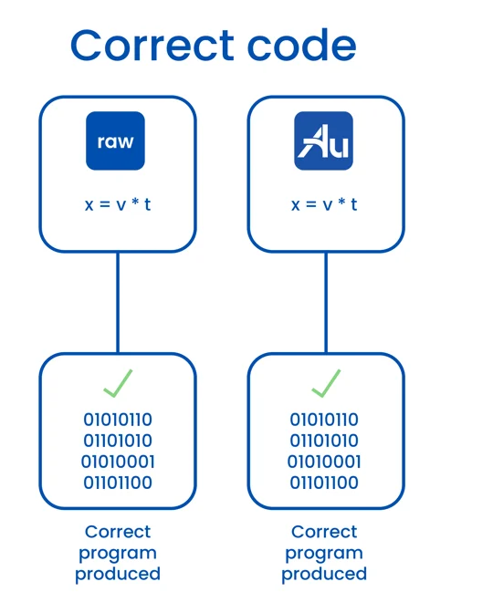
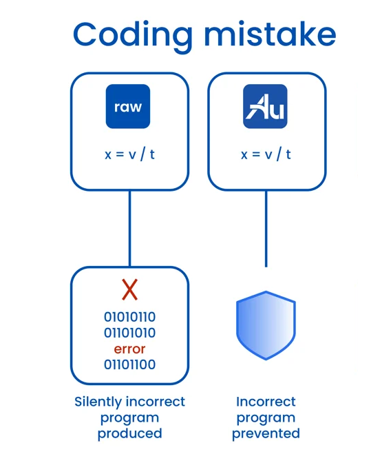

# (Title image placeholder)

Notes:

Welcome!  As C++ programmers, we're frankly spoiled by how easy it is to handle our time quantities,
thanks to the `std::chrono` library.  Today we'll learn how to bring that same expressiveness and
robustness to **all** physical quantities.  Our new open source library, Au, makes this... well,
more than just possible; it makes it easy.

But this talk isn't _just_ about Au.  It's really about the whole _ecosystem_ of such libraries that
people have written to meet this need.  The ecosystem has different niches.  And the libraries _in_
that ecosystem influence each other, both through competition and collaboration.  These interactions
make every participating library stronger, and it's the _entire C++ community_ who benefits.

---

## Units library: basic concept

<div class="r-stack">
<div class="fragment fade-out" data-fragment-index="1">

```cpp [1-2]
// No units library:
double distance_m;


```

</div><div class="fragment fade-in" data-fragment-index="1">

```cpp [4-5]
// No units library:
double distance_m;

// With units library:
Quantity<Meters, double> distance;
```

</div>
</div>

<div class="fragment" data-fragment-index="2" style="width: 50%; display: block; float: left;">

</div>

<div class="fragment" data-fragment-index="3"style="width: 50%; display: block; float: left;">

</div>

Notes:

Let's start by getting on the same page about what a units library is.

Suppose you have a variable that has units, like this distance measured in meters.  Without a units
library, _you're_ on the hook for keeping track of those units --- see the "underscore-m" on the
variable name?

**(click)**
_With_ a units library, you have a special _type_ that knows about the units.  It's as if we can
apply the units as a "tag", to say _this_ double is a _quantity of meters_, in a way that shifts the
burden to the compiler (and lets us drop the underscore-m).

**(click)**
The amazing and beautiful thing is that this "tag" gets optimized out when we build the program.  If
you've written correct code, the compiler will produce _the same program_ you would have had without
the library.  This means there's no runtime penalty!

**(click)**
But what's even better is what happens when you write _incorrect_ code.  Without a units library,
you'll get what you usually get: it produces a _silently incorrect program_, which is insidious.
_With_ a units library, though, it produces a compiler error to tell you what mistake you made!

---

## Aurora Innovation


Notes:

This kind of safety is critically important where I work, which is Aurora Innovation.  Our mission
is to bring the benefits of self-driving technology to the world _safely, quickly, and broadly_ ---
in that order.  In building our product, the Aurora Driver, we have _many_ use cases for tracking
physical units in C++: everything from embedded systems, to the autonomy stack, to remote assistance
and user interfaces --- it's a ubiquitous need.  And while tracking units is a very small part of
the problem, it's also critically important, and we need to solve it _robustly_ so we can keep our
focus on harder problems.

---

## Flashback: CppCon 2021


Notes:

This isn't our first units talk at CppCon.  We also presented a talk in 2021 which explained what
we'd learned from our experience handling units in C++.  The talk was well received and is still
worth your time, but I'll highlight a few key points for those who missed it.

First: actual unit errors are surprisingly rare, even _without_ a units library.  So what's the
point of using one?  The point is that the _reason_ they're rare is _lots of manual work_.  The
**primary** value of a units library is to let you **redeploy** that effort to more interesting
problems.

Second: it's the _quality of the interfaces_ that determine how much of that developer velocity you
can actually _capture_.  We listed some key properties to look for, like unit safety, conversion
safety, fluent mixing of numeric types, and so on.  Unfortunately, the only units library that had
_all_ these features was our _internal-only_ library.

Thankfully, things have improved in two years.  First, the ideas have been out there for two years,
and started influencing other units libraries.  But second, at long last, our own library, Au, is
now fully publicly available.

---

# A taste of Au

Notes:

Let's start by getting a small taste of the library.  We're going to speed through a couple of
examples, and mention some concepts and resources that will make the library _so_ easy to learn.

We won't linger here because even though this talk is about Au, the _main_ goal of the talk is to
empower you to choose the units library that best meets _your_ needs.  So we'll devote more time to
that decision framework.

---

## Example: time to goal

<!-- TODO: time permitting, visualize the situation before the first column pops up? -->

<div class="container">
<div class="poor fragment">

### No units library

```cpp
const double dist_to_goal_m = 30.0;
const double speed_mph = 25.0;
const double speed_mps =
  speed_mph * MPS_PER_MPH;
const double time_to_goal_s =
  dist_to_goal_m / speed_mps;
```

<div class="fragment">

```cpp
// unit_conversions.hh
constexpr auto CM_PER_MI =
  2.54 * 12.0 * 5280.0;
constexpr auto M_PER_MI =
  CM_PER_MI / 100.0;
constexpr auto S_PER_H = 3600.0;

constexpr auto MPS_PER_MPH =
  M_PER_MI / S_PER_H;
```

</div>

</div>
<div class="good fragment">

### Au

```cpp
const auto dist_to_goal = meters(30.0);
const auto speed = (miles / hour)(25.0);


const auto time_to_goal =
  (dist_to_goal / speed).as(seconds);
```

</div>
</div>


Notes:

Let's begin with a very simple example.  We're driving at a constant speed, and we have a goal which
is some known distance away.  How much time will it take to get there?

**(click)**
If you don't have a units library, you'll probably do it something like this.  You've got your
variables for distance, speed, and time.  And of course you're very careful to _specify the units_:
you use these suffixes, like "m" for meters, and "mph" for miles per hour.  You also need to do your
unit conversions manually, which is tedious but straightforward.

**(click)**
You've probably got constants like these in some common header file with its own unit tests.

**(click)**
Now here's what this looks like with Au.  We see some changes right off the bat.  First off, the
suffixes _vanish_ from the variable names, because the _library_ is doing the work.  This first line,
`meters(30.0)`, takes the value `30.0` and **encapsulates** it inside of a quantity.  Once it's
there, it's _safe_: you can do any _meaningful_ thing you like, but it will _prevent_ you from
making mistakes with your units.

The other thing is that we can get rid of all of these conversion factors, and instead we just
directly state what we want.  The time to goal is this ratio, _as seconds_.  When we write this
line, the compiler computes the final conversion factor, a single number equivalent to
`MPS_PER_MPH`, _at compile time_, and correctly multiplies it.

So there's work that we _were_ doing, manually checking units and conversion factors, and now the
compiler's doing it for us.  We can _redeploy that effort_ to more exciting problems!

---

## Example: CPU ticks time units

```cpp
// Defined in a header somewhere:
constexpr uint64_t CPU_CLOCK_HZ = 400'000'000;

std::chrono::nanoseconds elapsed_time(uint64_t num_cpu_ticks) {
    using NS_PER_TICK = std::ratio<1'000'000'000, CPU_CLOCK_HZ>;
    return std::chrono::nanoseconds{
        num_cpu_ticks * NS_PER_TICK::num / NS_PER_TICK::den
    };
}
```

```cpp
// Defined in a header somewhere:
constexpr uint64_t CPU_CLOCK_HZ = 400'000'000;

std::chrono::nanoseconds elapsed_time(uint64_t num_cpu_ticks) {
    constexpr auto cpu_ticks = inverse(hertz * mag<CPU_CLOCK_HZ>());
    return cpu_ticks(num_cpu_ticks).as(nano(seconds));
}
```

```cpp
// Defined in a header somewhere:
constexpr uint64_t CPU_CLOCK_HZ = 400'000'000;

std::chrono::nanoseconds elapsed_time(uint64_t num_cpu_ticks) {
    constexpr auto cpu_ticks = inverse(hertz * mag<CPU_CLOCK_HZ>());
    return cpu_ticks(num_cpu_ticks).coerce_as(nano(seconds));
}
```

Godbolt: https://godbolt.org/z/48vEoYjaj

Notes:

Here's another example.  This one's from the embedded domain.  Let's say we have hardware which
measures timestamps as the integer number of CPU cycles that have elapsed since startup.  Now, we
want to work with that in more familiar time units such as nanoseconds.  So we can create
a `std::ratio` to get our conversion fraction in lowest terms, and then we do the integer math of
multiplying and dividing.  This might even be right!  There's a 50% chance, but in the worst case
we'll just flip the fraction.

Now here's how we can do this with Au.  We can simply define an ad hoc time unit that corresponds to
one CPU tick.  It's the inverse of the CPU frequency, which is one hertz times this _magnitude_, mag
of CPU clock hertz.  And then we write `cpu_ticks` of `num_cpu_ticks`, which is clearly correct, and
finally, `.as` nano seconds.

This doesn't compile.  Well, of course it doesn't!  This is a truncating conversion: times 5, and
then integer-divide by 2.  If we know what we're doing, we can coerce the compiler to disregard this
safety check.

**(click)**

So, instead of dot-as, we say dot-coerce-as, and now this is correct.  And yes, Au's integer
quantity of nanoseconds will automatically convert to the `std::chrono::nanoseconds` return type.

**(click)**

If we look at the assembly in godbolt, we can see that the functions do the same thing.  It's just
that it's easier to see that the second one is correct.

And this is just a no-op change.  We could reap even more benefits by moving this unit definition
upstream in our project, and passing timestamps around our program _natively in this custom unit_!
But this is a good start.

---

## Au: Interfaces and Idioms

Notes:

We're getting a picture of the core idioms of the library.  It's built around our workhorse type
template, which is `Quantity`.  It basically "tags" a value of any numeric type with the _units_
that give that value its meaning.

`Quantity` is a _safe container_ for your value, because it guards the entry and exit.  To put your
value inside, you call a function with the name of your unit.  To get the value back out, you call
dot-in your units, which is short for "value in".  Notice the symmetry: it's as if the unit name is
a _password_ which we set when we store our value, and which we must speak to retrieve it.

For unit conversions, we use the same API, but just pass a different unit: dot-in other-units.  Of
course, this exits the safety of the library, and makes _us_ responsible for keeping track of the
units... ugh.  To stay _within the library_ when we do the conversion, we say dot-as instead of
dot-in.

"In" and "as" are vocabulary words with consistent meanings: "as" makes a quantity, and "in" makes
a raw number.  So for `std::round` we also have "round_as" and "round_in", and similar for
`std::floor` and `std::ceil`.  Note that we _definitely don't_ have `round` without a unit slot,
because this makes no sense.  Can you round your height to the nearest integer?  No --- but you can
round it to the nearest integer number of _feet_, or _centimeters_.  This principle is _unit
safety_: a core principle of Au's design, which we'll mention again later.

Finally, we have other vocabulary words that we can compose with these.  The newest one is "coerce",
which tells the compiler to ignore safety checks for truncation or overflow for when you know it's
OK to do that.  So when you see `length.coerce_as(feet)`, you'll know what it means if you learn to
speak Au.

---

## Au: learning more

Notes:

If you want to learn _by doing_, our docs are pretty good, and I especially want to emphasize two
resources.

First, we have tutorials that you can work through, including interactive exercises.  We do expect
that everyone will be able to just clone the repo and be up and running building and testing
immediately, without installing anything.

Second, we have a troubleshooting guide.  This contains examples of common Au compiler errors,
explains what they mean in plain English, and shows how to fix them.  It also includes compiler
error text from clang, gcc, and MSVC, so you can literally `Ctrl-F` on the page and start typing in
parts of your compiler error to jump to the right section.

So there we have an appetizer of sorts for the Au library.  There's much, _much_ more we could say.
But first, I want to zoom way out and get clear on the bigger picture.

---

# C++ Units: the goal

Notes:

What are we trying to accomplish when we write a units library?  Sounds obvious: it's to provide
robust physical units support --- to make it easy and delightful to get this stuff effortlessly
correct.  Well, that's true, but it's only _part_ of the goal.

---

## All of the people, all of the time

Notes:

The _full_ goal is to do this

- for as _much of the C++ community_ as possible,
- for as much of the _time_ as possible.

Starting _right now_, because we can't affect the past anymore.  If the vertical dimension
shows the --- _very diverse_ --- community of C++ users, and the horizontal dimension shows time, we
want to cover as _much_ of this diagram as possible with units support that's as _good_ as possible.

Accurately expressing our goal is the first step to getting a chance to meet it.

Now, we can use this model to evaluate candidate solutions.  For example: shouldn't there be
a _standard units library_?  I think there should!  And I'm actively collaborating with others who
are working to make it happen on the mp-units project --- you should come to our Open Content panel
discussion tonight.  Now let's see how a standard units library fits in on the diagram.

---

## Standard units library?

Notes:

The sad news is that there's literally zero chance for a standard units library before C++29.  So it
comes into play sometime around here, after a roughly six year gap.  And then it reaches various
parts of the community only gradually: it takes time to upgrade to a new standard, and some use
cases need validated toolchains, which won't even exist until years after the new standard drops.

Again: should there _be_ a standard units library?  Absolutely!  But this just makes it clear that
it can't be the _whole_ solution.

In fact, I believe that no single library can be the whole solution until _standard units_ has been
around as long as standard _chrono_.  I think the way to cover this diagram is with an _ecosystem_
of libraries.

---

## The C++ Units Library Ecosystem

Notes:

Different users have different needs.  One project needs a specific validated toolchain which
doesn't yet exist past C++14.  Another project needs robust support for C++17's `optional`, or
C++20's concepts.  One project uses `double` for everything without a second thought.  Another
project runs on embedded hardware that can only use integers.

It's difficult for any one library to satisfy all of these use cases well.  Therefore, the ecosystem
has _niches_.  It can support multiple libraries, coexisting for extended periods of time.  _And
that's good_, because the libraries are _little laboratories_ for how to handle units in C++.  We
can try things out, and find out not just what works great, but also what ideas _sound promising_
but have hidden pitfalls.

If we embrace that ecosystem viewpoint, we see the libraries interacting through both competition
and collaboration.  They can adopt each others' strengths, and learn from each others' mistakes.
This makes the whole _ecosystem_ stronger, and it meets the _community's_ needs better.

---

# Framework for choosing a units library

Notes:

Of course, this diversity can be overwhelming for end users, each of whom can only use _one_
library.  How do you choose which library is best _for you_?

As a framework for making this decision, I suggest asking the following three questions, in order.

1. First: _can you get it_ in your project?

This question considers both the C++ standard version which the library requires, and the mechanism
for delivering the library to your project.

2. Second: what does it _cost_, in terms of developer experience?

This question covers the main reasons that teams who _could_ use a units library choose _not to use
one at all_.  These are:
    a) how much does it slow down compilation?  And,
    b) how hard are the compiler errors to _understand_, and to _fix_?

3. Third question: how do its "units-specific" features compare to other libraries?

Here, there are many, _many_ considerations.  We'll only have time to touch on a few in this talk.

---

## Full comparison

Notes:

However, if you want a fuller comparison, you can check out the "alternatives" page on our
documentation website.

You can see here we have screenshots of the comparison table for each of the three questions in the
framework.  The rows represent the points of comparison, and the columns represent the units
libraries we're comparing.

So here you can see visually: the units library features in question 3 are far, _far_ more numerous
than the others.  Of course, not all rows are created equal, and the ones higher up tend to be more
important than the ones lower down, sometimes much more.

---

# Au and alternatives

Notes:

But before we get into those rows, let's introduce the columns: which units libraries we're
comparing.  Here, too, there are too many to cover, and they range from obscure hobby projects to
those that aspire to rigor and production quality.  To narrow it down to a reasonable number, we
included two categories of library.  First, there's any library with _at least as many GitHub stars_
as Au.  And second...

---

## Libraries considered

Notes:

...there's _boost units_.  We're waiving the GitHub stars requirement because this library has been
around since before work started on _creating GitHub_.  Boost units is notable for the rigor and
clarity of its documentation, and for being ahead of its time in many ways: they were _so close_ to
inventing vector space magnitudes, for example.

Next up, the nholthaus library made a splash in 2016, kickstarting the modern C++ units library
revolution.  Until last month, it had the most GitHub stars of any units library in _any_ language.
This library's hallmark is being _extremely_ accessible and low friction --- seriously, it's just so
easy to get started and to use.

Next we have the SI library, whose amazingly inviting logo promotes a solid and user-friendly set of
APIs.  Despite being relatively newer, it has skyrocketed up the GitHub stars chart, with no sign of
slowing down.

Finally, we have mp-units, which takes full advantage of bleeding edge post-C++20 features to see
just how far we can take our interfaces.  Besides being a top-notch units library you can use
_today_, it also serves as a vehicle for designing a possible future standard units library.  And
just this year, the library underwent a _major_ overhaul with its V2 interfaces, giving it
a stunning leap forward in composability, simplicity, and power: very exciting!

Again: there are _many_ other options out there, but these leading libraries give a good flavor for
the comparison.  Now let's see our decision framework in action.

---

## 1. Can you get it?  a) C++ standard compatibility

2023 ISO survey: https://isocpp.org/files/papers/CppDevSurvey-2023-summary.pdf

Make a plot for C++11,14,17,20

Align with list of new features for each version

Notes:

For the first question --- "can you get it?" --- we start by checking C++ standard compatibility.
Each new C++ standard brings the benefits of new features, but also the cost of excluding more and
more users.

Let's start by looking at the latter.  These are the results of the 2023 ISO C++ Developer Survey
question: what C++ version can you use on your current project?  We see C++11 covers nearly 91% of
users, with C++14 close behind at 85%.  C++17 is significantly lower, at 73%, and C++20 drops off
a cliff at 29%.  So to move up a rung on this ladder and justify leaving people behind, you really
need to get some major benefit from that new version.

So where do the libraries show up on this chart?

No surprise here, boost is the compatibility champ, supporting all versions of C++ back to 98.

I think in today's world, C++14 is a strong local optimum.  The marginal exclusion compared to C++11
is very small, but the features you gain are extremely useful for units libraries.  Both Au and
nholthaus units live here.

I think C++17 makes less sense _right this minute_.  On the one hand, you lose a much bigger chunk
of users.  On the other, the features you do gain mostly help with implementation details, not end
user interfaces.  That said, C++17 adoption is _rapidly_ expanding, so I expect this to matter much
less very soon.

C++20, where mp-units lives, does exclude the majority of users, but this steep cost buys amazingly
useful features, especially concepts.  And think about it: if the library's goal is to help design
a standard units library, then of course it should liberally use features from all _previous_
standards without fear.

Also, keep in mind how this criterion works in practice.  When we measure exclusion, we're looking
at _all C++ projects simultaneously_.  What matters for _you_ is _your project_ only.  So for
example: if you're in the 29% that can use C++20, it doesn't matter that others are excluded; this
is a complete non-factor for _you_.

---

## 1. Can you get it?  b) Delivery mechanism

Show same figure as before, with logos under which category

- First click: Au logo in 2 places
- Second click: screenshot (or text box?) of manifest showing up on top

Notes:

The next part of "can you get it": how is the project delivered?

There are two main paradigms here.  There's "full library" delivery, where you have a DAG of
files, and users can include whichever headers they need.  Then there's the "single header"
approach, where one gigantic file contains the whole library.

The full library approach gives you more flexibility.  For example, you can have a separate header
for unit test utilities, one for I/O helpers, maybe one for each unit of measure, and so on.  The
downside is that it's more complicated to get it into your project: you need to have build target
rules expressed in _your project's_ build system, whether CMake, bazel, or something else.

The single header approach is less flexible: you get everything in the header, and nothing outside
of it.  But it makes up for that by its stunningly easy delivery: it's just one file that you put in
your project.

**(click)**

Here's how the libraries shake out.  boost, SI, and mp-units are delivered as full libraries,
which gives great flexibility, at the cost of more challenging setup.  nholthaus on the other hand
takes this single file approach, which makes it amazingly easy to set up, but can reduce
flexibility.  So what about Au?

**(click)**

We have the best of both worlds!  The library is composed of separate, single-purpose targets, for
those who want flexibility.  But we provide a script to package the library into a single header
file.  You can customize the precise choice of units, and toggle the infamously heavy `<iostream>`
dependency.

**(click)**

In fact, Au provides the _best_ single file solution, because it generates a manifest comment which
lists the precise release number and git commit used, the presence or absence of I/O, and the units
which were selected, bringing clarity and traceability to your repo.

We provide pre-generated single-file versions on our documentation site which include just the SI
base units.  That's why the abstract claims you can be up and running in less time than it takes to
read the abstract.  Of course, you're better off taking 10 minutes to make the custom version that
meets your needs best.

But the beauty of this hybrid approach is that you can use the single file version to get started
quickly.  You'll obtain probably 95% of the benefits.  Then you can bother setting up the full
install _only when you need it_, if ever.

Full disclosure: the full installation is bazel-only for now.  We're going to need to lean on the
community for CMake support.  Pull requests welcome!

---

## 2. DevEx cost?  a) Compile times

Notes:

Now for the _cost you pay_ in your developer experience.  We'll start with the first cost: compile
times.  We know they will increase, because the compiler is doing _more work_ to produce the _same
program_ you would have had without the units library.  That extra work, of course, goes into
catching mistakes that would otherwise produce incorrect programs.

For this, we only have data for Au and nholthaus, simply because our measurement setup uses bazel to
build.  I'd really love to see a more comprehensive comparison, but this is what we have.

We took a couple files heavy on kinematics, and rewrote them natively and idiomatically with Au,
nholthaus, and a baseline of no units library using raw `double`.  Here are the results.

**(click)**

First, the default configuration.  We can see the slowdown for both, but it's much larger for
nholthaus: always multiple seconds, and more than tripling the time for the smaller file.  This is
widely known and acknowledged.  I've seen teams at multiple companies choose _no units library_ over
nholthaus for this reason.

**(click)**

When we trim I/O support from both libraries, we do see some improvement, particularly for the
nholthaus library.

**(click)**

Finally, what makes the _biggest difference_ for both files is **trimming unused units**.  In Au's
case, this means switching from single-file to full delivery, and only including the units used in
these functions.  For nholthaus, this massively improves their performance.  The library has
literally hundreds of units in that single file.  Each unit is very fast to compile, but they really
do add up!

But the takeaway here is that even Au's worst case is competitive with any configuration of
nholthaus: Au simply never has a severe compile time penalty.

---

## 2. DevEx cost?  b) Compiler errors

Notes:

The other reason people stop using units libraries is inscrutable compiler errors.  We'll look at
a very simple example: we'll try initializing a _speed_ with a distance _times_ a duration, instead
of divided by.

So here's what we get with boost.  I think this shows why despite the amazing benefits, many
projects have opted _not_ to use a units library over the years.  This is very forbidding.  We're
also for some reason mentioning kelvins and candelas multiple times.

Next up is nholthaus.  It's not really any easier to understand.  These `std::ratio<0, 1>`'s that
litter the text are the _exponents for the dimensions_.  These are positional arguments.  So
basically, we still have the problem that we have to mention every dimension, even the irrelevant
ones, only now we can't even know what they are unless we read the library source code.

Now for mp-units.  Since it's C++20 only, I switched to a newer compiler.  But that's not the reason
this is _such_ a breath of fresh air.  It's because of a feature which mp-units pioneered: _opaque
unit types_.  What this means in practice is that when you say "meter", it's an actual, simple type,
not an alias that resolves to a complicated compound template.  I think this is one of the two most
significant advancements in C++ units libraries in the past decade, the other being vector space
magnitudes.

So how about Au's compiler errors?  Similarly concise: we have opaque unit types as well.  In some
ways they may be a little easier to read: you can see that this is the _product_ of meters and
seconds up here, and the _product_ of meters and _seconds-to-the-minus-one_ down here.  But in any
case, both Au and mp-units keep these compiler errors _short_ and _human-readable_: a tremendous
boon for end users.

<!--
Godbolt links:
    - boost (https://godbolt.org/z/Wz1ohs33f)
    - nholthaus (https://godbolt.org/z/7f9YanMx1)
    - mp-units (https://godbolt.org/z/nEd7ncWhe)
        - Note: Needed to use a newer compiler version to get C++20 support.
    - Au (https://godbolt.org/z/ao1afvEas)
-->

---

# Au: core features

Notes:

Now for the third question in our framework, we can finally start evaluating units library features.
We'll emphasize those we consider the most important.  Naturally, these tend to be particular
strengths of Au, because we focused on what we thought was important when we built it.  The section
_after_ this one will look at some other features where we fall short.

We won't have time to compare every library on every criterion --- you can see our doc website for
that --- but we will mention other libraries where appropriate.

---

## Same program, only safer

Notes:

The first feature is to be _agnostic_ as to the _underlying numeric types_ in the program.  Some
projects just use `double` everywhere, which is fine.  But others may store their quantities in
`float`, or various integral types, which is very common in embedded applications.

The best value proposition which a units library can provide is: _same program, only safer_.  If
somebody without a units library is storing a value in some type, then we should let them use that
_same type_ under the hood.  Otherwise, we complicate their decision: to get the safety they want,
we force them to evaluate this superfluous change to their program at the same time.

With Au, it's very easy to turn an arbitrary type into a quantity.  The _name of the unit_ is
a function: you can pass it any numeric value, and get a quantity of that _same type_.  So, `6` is
an `int`; `feet(6)` is a `Quantity<Feet, int>`.

All of the libraries listed here support customizing the numeric type.  However, with nholthaus,
this isn't present in the user-facing interfaces: there's a single global type which defaults to
`double` and gets used for all quantity types.

---

## Conversion safety

chrono code goes here

```cpp
QuantityU32<Nano<Seconds>> dt = seconds(5);
```

```
error: conversion from 'Quantity<au::Seconds,int>' to non-scalar type 'Quantity<au::Nano<au::Seconds>,unsigned int>' requested
```

Notes:

Of course, being able to store integers is one thing.  What happens to them in calculations is quite
another --- especially when those calculations involve unit conversions.

We have some intuition from the chrono library here, which uses integers heavily and has a proven
track record doing so.  Let's take a duration of integer seconds.

- We can assign it to an integer _millisecond_ duration, because we know that's exact.
- We _can't_ assign it to an integer _minutes_ duration, because that could truncate!
- We _can_ assign it to a _floating point_ minutes duration, because that will be more accurate.

Any units library that is designed to support integers should follow this policy as a baseline.  The
nholthaus and SI libraries primarily have floating point applications in mind, so they silently
permit the truncation in the middle case.  Boost, mp-units, and Au all prevent it.

That said, this is only a baseline.  Consider this case in the chrono library, where we store
nanoseconds in a 32-bit integer.  We initialize it with a small number of seconds, 5 seconds.
Instead of storing 5 billion nanoseconds, we find just 705 million, which is only 0.7 seconds!  Well
of course we do, because 5 billion can't fit in a 32-bit integer.  But the point is that there's
another kind of risk with integers: besides _truncation_, there's _overflow_.

Now of course, chrono takes this into account and they do have a strategy.  They designed their
_primary user-facing_ types to make overflow unlikely. Storing nanoseconds in uint32 is _not_
idiomatic chrono usage; you would use `std::chrono::nanoseconds`, which is at least 64 bits.  But
this kind of strategy doesn't scale to a whole system of quantities, where new dimensions can get
created on the fly.

**(click)**

Here's the corresponding Au code.

**(click)**

And here's the result: a compiler error.  Au knows this conversion multiplies by 1 billion, and it
knows the max value of the type is less than 5 billion.  Au considers the overflow risk too high,
and it prevents it from compiling.

---

## More conversion safety: the "safety surface"

Safety surface from blog post

Notes:

In general, overflow risk is a function of both the conversion factor, and the size of the integer
being used.  Thus, we can visualize this in a plot.

For each integer size, and each conversion factor, there is some smallest value that would overflow.
We prevent the conversion when that value is small enough to be "scary".  What's "scary"?  Well, we
definitely want people to feel confident using values less than 1000, because for those values they
can't jump to the next SI prefix up.  Our threshold gives some breathing room.  It's over 2000,
which lets us support conversion factors of a million in a 32-bit signed integer.  Go ahead and
initialize your hertz frequency with a megahertz value!

If we trace the boundary between permitted and forbidden conversions, we get this _overflow safety
surface_.  The practical effect is that users feel empowered to choose the integer types that best
suit their program, because they know that Au is watching out for the dangerous conversions.

**(click)**

In terms of libraries, the nholthaus and SI libraries don't protect against truncation; boost and
mp-units follow the chrono library policy; and only Au has the overflow safety surface.  I would
like to see other libraries try it out in practice.

---

## Unit safety

Notes:

Here's an important principle which I love to emphasize: unit safety.

We say that a program is "unit safe" when the correct handling of physical units can be verified in
_each individual line_, by inspection, in isolation.

This is all about minimizing cognitive load.  Once you read a unit-safe line, you're done!  You know
that _if_ your program contains a unit error, then it lives somewhere else.

The way you get this is to _name_ the unit, at the _callsite_, every time you enter or exit the
units library.  So, with a height of 1.87 meters, when we say `height = meters(1.87)`, we have
_named the unit_ as we enter the library.  Our value is stored safely inside of the _quantity_,
`height`.  We know that every operation we can perform on `height` will _safeguard_ that unit
information.  And the only way to get that raw value out is to _name the unit_ once again.  So,
let's say we're serializing this in a protobuf.  We would call
`proto.set_height_m(height.in(meters))`.  "m", "meters": this is a "unit-safe handoff".  We don't
need to see a _single other line_ of our program to know that _this line_ handles units correctly.

Now, in fairness, I have received some pushback about this interface, and the lack of a function to
just get the underlying value without naming the unit at the callsite.  _However_, one hundred
percent of that pushback came in the _design phase_.  In the two-plus years we've been using it in
production, I haven't received a single complaint.  Not only is unit safety just not a burden, but
you really do come to appreciate it!  It's hard to go back to calling `.count()` on a duration.

In terms of other libraries, mp-units is the only one I know which follows this principle, and its
unit safety is every bit the equal of Au.

---

## Embedded friendliness

Notes:

I'm not an embedded programmer.  So why do I claim that our library is embedded friendly?  Because
Aurora's embedded developers have been treated as first class citizens with a seat at the table
since the beginning of the design phase.

Let's get concrete.  What makes a units library "embedded friendly"?  A few things.

- First: robust support for integer types.  Again, the library shouldn't force users to change the
  numeric types in their program just to be safer with units: don't complicate the decision!  When
  we used the nholthaus library in embedded code, it did have this effect.  Au doesn't even have
  a "default" storage type: they're all on equal footing.

- Related to integer handling: we really need that conversion safety we talked about before.  This
  should be a chrono duration-like policy at a minimum, but of course Au's overflow safety surface
  is even better.

- Finally: string handling.  `<iostream>` is an incredibly heavyweight dependency, so it needs to be
  easy to exclude it.  We provide all of our unit labels as `const char` **arrays**, not `const
  char` **pointers**, which gives us the ability to call `sizeof()` on them.  This even applies to
  compound labels that we generate automatically on the fly, such as `(m * kg) / s^2`: even these
  are stored in simple arrays.

When we talk about meeting the needs of _the entire_ C++ community, remember that embedded
developers are a critical and often-overlooked part of that community.

---

## Composability

Notes:

Composability: this is one of my favorites.  "Mommy, where do units come from?"  Well, units almost
always come from _combining other units_.  So what we want is for the units library to let us
compose units in these same ways.

We've seen that `meters` is a quantity maker: you can call it on any numeric type, and it makes
a quantity of meters.

Well, so is `meters / second`.

And `kilo(meters) / hour`.

And `meters / squared(second)`.

You can call any of these quantity makers to make a quantity.  The fluidity of combining units and
prefixes to make new units makes the library a delight to use.

Au was the only library I knew with this kind of composability for about a year, although most of
that time predates our open source release.  Happily, this is no longer the case: the V2 interfaces
of mp-units are every bit as fluently composable as Au.  I don't know of any other libraries that
come close, though.

---

## Unit-aware inverses

Notes:

Here's a fun one.  Say we have a process running at 400 Hz.  What's the period, as an integer?

Well, period is one over frequency.  But one over 400... as an _integer_... that simply truncates to
zero, right?

In seconds, yes, it does.  But we could represent this period as 2500 _microseconds_!

The key here is that if you specify the units for your result, then this _implies_ the units we
should use for 1.  We can represent 1 in different units, different _dimensionless_ units.

Solve this equation for 1: we can see that its units should be the **product** of the units for
period and frequency.  Hertz times milliseconds... that equals millionths.  One is one million
millionths.  Therefore, the program we generate under the hood will divide 400 into one million.

Here's the software API we use to express this.  `inverse_as(micro(seconds), hertz(400));`.  This
gives `micro(seconds)(2'500)`.  I haven't seen this in any other units library.  I'd like to see it
explored more.  In fact, I'd like to see it taken further --- maybe with more general _quotients_
instead of only exact inverses.  I think there's fertile ground here.

---

# Au: missing features

Notes:

So we've seen some pretty cool features of Au, which raises the question: why might you _not_ want
it?  We'll do a quick tour of a few things we don't currently have.

---

## Decibels

Notes:

First off: _decibels_, and other logarithmic units like _bels_ and _nepers_.  For these, the
nholthaus library is pretty much the only game in town.

_These can be subtle._  The definition can depend on whether you're dealing with so-called "power"
quantities or "root-power" quantities, which feels like it'll be hard to write generically.

The best way forward is to accumulate a comprehensive collection of acceptance test cases from
experts who use decibels in their daily job.  If we can get enough test cases and they're all
mutually coherent, we can do this.  If you're a decibel expert and you have test cases to suggest...
then, leave a YouTube comment down below; don't forget to like and subscribe to CppCon.

---

## Explicit systems of quantities

Notes:

So, Au can handle different systems of _units_: we can freely mix meters, feet, furlongs, you name
it.  What we _can't_ do is handle two incompatible ideas about _what dimensions exist_ at the same
time.

What does that even mean?  Here's an example.  SI units measure electric fields in volts per meter,
and magnetic fields are measured in Tesla.  In Gaussian units, they are _both_ measured in Gauss!
They have different dimensions in SI, but the same dimension in Gaussian units.

You can use SI units with Au.  You can use Gaussian units with Au!  But you _can't_ use them both in
the _same program_.

Now, this is an intentional design decision, to reduce complexity and the learning curve.  When it
comes to APIs, having one system is like having zero: it fades into the background, and we never
need to mention it.  What's water to a fish?

So Au is basically a good 90% solution.  To be crystal clear, I mean we meet 100% of the needs of
90% of users, **not** 90% of the needs of 100% of users.  Big difference.

---

## Quantity "kind"

Notes:

Next up: different "kinds" of the same quantity.  Can we compare, say, a radioactive _activity_ in
becquerel, to a _frequency_ in hertz?  They are both equivalent to inverse seconds!

With Au, we say: sure!  We don't _need_ to turn _every_ impermissible operation into a compile time
error.  If it passes the filters of same _dimension_ and same _magnitude_, then we freely allow
assignment, because the cost of catching these mistakes would be preventing too many legitimate use
cases.

That said, mp-units V2 has come up with a novel implementation for distinguishing different kinds.
I think it looks very exciting and promising.  So if this is really important to you, upgrade to
C++20 and check out mp-units.

---

### Aside: mistakes in the real world

Notes:

By the way: we've got 3 tiers of quantity mistakes you can make.

- First, wrong dimension.  You ask for a length, you get a temperature?  Total nonsense!
- Second, right dimension, wrong magnitude.  You thought the distance was 100 meters, but it was 100
  yards.
- Third, right dimension, _right magnitude_, wrong kind.  You assigned a _radioactive activity_ to
  a _frequency_.  Au doesn't care about this, but it cares about the first two.

So it feels like the first must be terrible, the second pretty bad, and the third somewhat bad.  But
what mistakes do people make _in the real world_?

The mp-units paper on safety lists 10 real-world errors, 9 of which are for quantities.  Now, most
of these aren't **software** errors, but they do show us the kinds of mistakes that people make.

Which categories do you think these will end up in?

**(click)**

Answer: one hundred percent are in the middle category: right dimension, wrong units.  Turns out,
when you ask someone for a length, they tend to give you a length!  But their length of 6 might not
be a length that you'd call 6.  So in terms of preventing bugs, handling unit conversion factors
delivers _virtually all_ of the value.

Now: please remember that preventing bugs is not the only --- _or even the primary_ --- value that
a units library provides.  The main value is to _accelerate development_.  The _more_ checks a units
library provides, the more _manual bug prevention effort_ we can redeploy to more interesting
problems.  So, kinds _do_ add value; mp-units has a very promising implementation; and I, former
skeptic, now hope to support them someday too.  All I'm saying with this slide is that this feature
is clearly in the region of diminishing returns.

---

## Unit symbol APIs (e.g., literals)

Notes:

Next up: user-defined literals, or UDLs.  Wait, we don't have those?  Who doesn't love writing `3_m`
instead of `meters(3)`?

Well, we do have these internally at Aurora; they were part of the original library.  At first, we
were going to port them over, but then mp-units abandoned them, and made some really compelling
arguments as to why.  They don't compose; they don't support different storage types well; they're
labor-intensive to define; and so on.  mp-units also engineered a better solution, initially called
quantity _references_.  You can see an example here: you can write "65 times mi slash h" to get 65
miles per hour.  This solution lets you compose units, it lets you use whatever numeric type you
want --- it's great!

Our plan is to explore some version of this approach instead of going with the popular but deeply
flawed UDLs.  That said, if you want UDLs in your project, it's easy enough to define your own, and
we'd be glad to provide guidance as to how.

---

# Inter-library interactions

---

## Feature inspirations

Notes:

The first kind of interaction is when a feature in one library inspires a feature in another.  I say
"inspires" because by and large, we don't see direct code sharing between the libraries.  It's more
that when authors see an idea working well in another library, they go and implement it themselves
in their own library's idiom.

So here are some examples.

- The single file delivery that makes the nholthaus library _so easy_ to obtain was a big
  inspiration for Au.  I think with the manifest comment, and the full install option, we even
  improved on this.

- _Strongly typed units_, originally by mp-units, was a revolution in usability --- remember those
  nice, clear compiler errors?  So this is an Au feature inspired by mp-units.

- One Au feature which mp-units now has is _unit-safe interfaces_.  It's really exciting to see
  better support for unit safety!

- _Vector space magnitudes_ is another Au feature that mp-units now has.  This is the one feature
  I know of that wasn't just inspired; it came from direct code sharing.  See, `std::ratio` works
  fine for the chrono library, but for a more general units library it utterly fails in multiple
  ways.  We brought this feature to mp-units via pull request before Au was open sourced.

- Finally, _composable units_ is a kind of pseudo-inspired feature.  Au did have it for almost
  a year before mp-units, but as far as I know this was just convergent evolution rather than
  inpsiration.

There's also an example of a "negative influence".  Units libraries are laboratories for ideas, and
sometimes those ideas don't work out.  The nholthaus library has automatic conversion from
dimensionless quantities, like _percent_, to raw numbers.  Unfortunately, individually reasonable
decisions end up interacting badly here, and the symptom is that the round trip implicit conversion
picks up a factor of one hundred.  We would have provided this feature, but we were able to learn
from their experiences and avoid the mistake.

So these are some ways the libraries have interacted in their _designs_.  But they can also interact
more directly, in the same program!

---

## Corresponding quantity mechanism

Notes:

Think about it --- if two libraries have a type that represents a quantity of seconds, _and_ if they
use the same underlying numeric type to store the value, then those two types are _morally
equivalent_.  It would be obnoxious if we had to get the value out from one library's type, and put
it in the other's!

Well, Au gives you the ability to "bless" one of these moral equivalancies, by specializing the
`CorrespondingQuantity` trait.  Au's Quantity has a template constructor that checks any type to see
if this specialization exists.  If it does, then you can pass Au quantities to APIs expecting the
other type, and vice versa.

The point of this feature is to reduce the friction for migration as much as humanly possible.  It's
part of being a good citizen of the C++ units library ecosystem: minimizing artificial barriers
forces each library to compete on its own merits, rather than inertia.

So in this example, say we were using this `MyMeters` struct in our project, and we want to upgrade
to Au.  We can pass our `MyMeters` values to this API that takes an int quantity of meters.  In
fact, we can even pass it to an int quantity of micro meters!  But not nanometers, because the
overflow risk is too high: that's right, you get the overflow safety surface here too!

This feature means you can do your migration in arbitrarily small steps: migrate only one target at
a time, without needing to update all of its callsites.

True, there are limitations.  A _vector_ of quantities can't be automatically converted from one
library's type to another's, for instance.  But in practice, this feature makes migration _much
easier_.

As we saw earlier, Au already provides this interoperability for chrono library durations.

---

## nholthaus compatibility layer

Notes:

We also created a compatibility layer for the nholthaus library, because we used it at Aurora before
we had Au.  This layer is publicly available in our repo, and we explain how to use it on our doc
website.  But here's the basic picture.

Remember that the nholthaus library is a single file, `units.h`.  Well, the first thing we did was
move it to another file, `units_impl.h`.  The new `units.h` includes Au, and it includes our
compatibility layer code.  So now, everyone who includes the old library also has access to the new
library, and can begin migrating APIs piece by piece as they see fit.  When a package is fully
migrated, we can depend directly on Au instead of on the `units.h` shim!

So, migrating in this way can be done _incrementally_, with minimal disruption to end users.  We've
seen it work really well in practice.

---

# Conclusion

Notes:

So, that's Au, the newest member of the C++ units library ecosystem.  It's let us handle physical
units **safely**, thanks to our pioneering unit-safe interfaces and the overflow safety surface.  It
works **quickly**: not _just_ zero runtime overhead, but also easy installation and fast compile
times.  And now, at long last, we are sharing it **broadly**.

If you handle physical units in C++, _you owe it to yourself_ to use... well, not necessarily Au,
but a units library that meets **your** needs _at least as well_ as Au does.

I'm grateful for your time and attention, and excited to entertain your questions!
