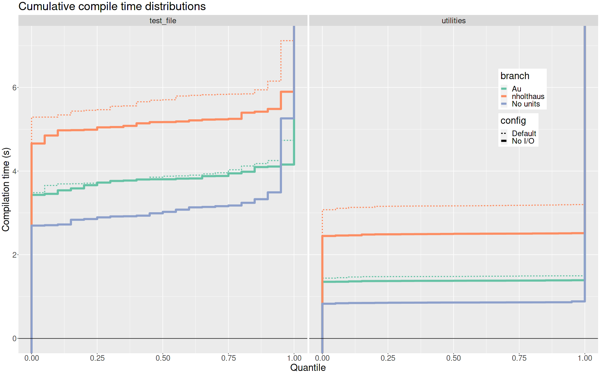
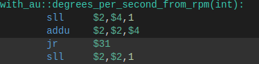
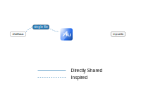
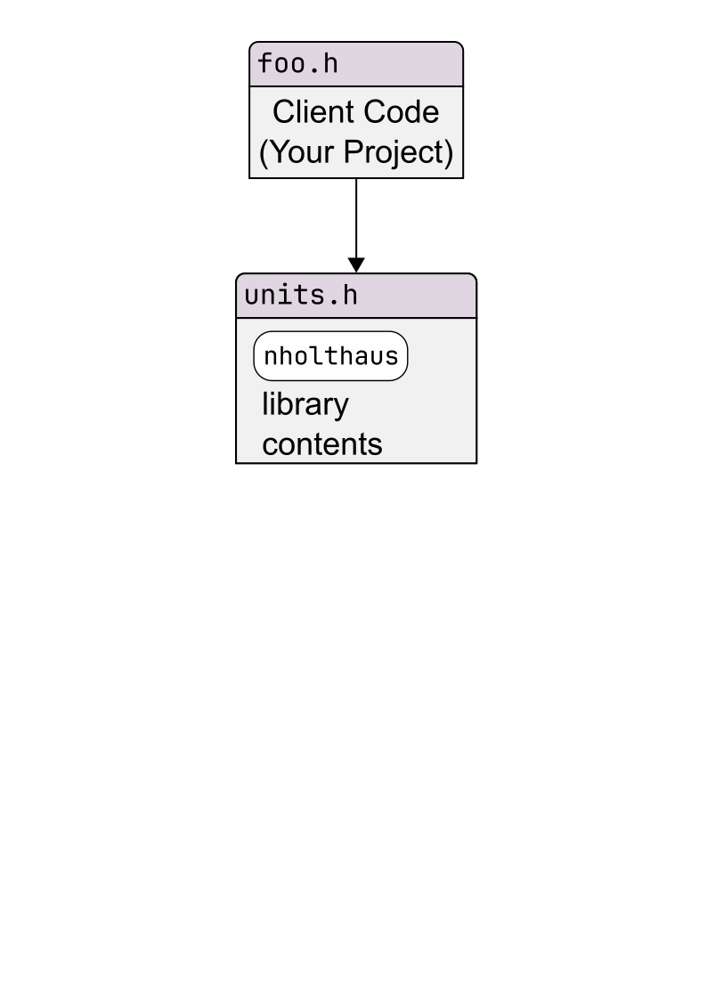
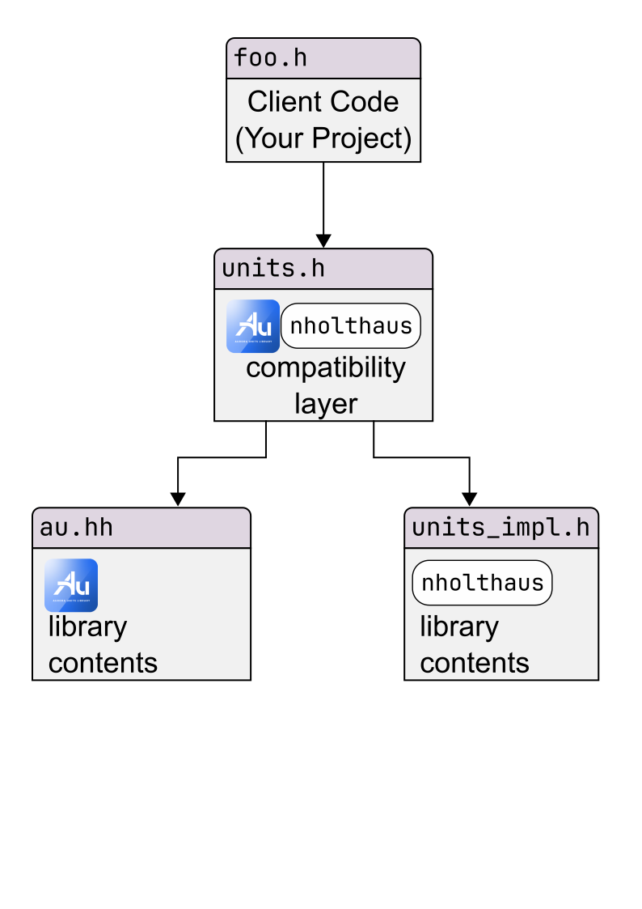

<section data-background="./The_Au_Library-_TitleCard_copy.png" data-background-size="contain">

Notes:

Welcome!  As C++ programmers, we're frankly spoiled by how easy it is to handle our time quantities,
thanks to the `std::chrono` library.  Today we'll learn how to bring that same expressiveness and
robustness to **all** physical quantities.  Our new open source library, Au, makes this... well,
more than just possible; it makes it easy.

But this talk isn't _just_ about Au.  It's really about the whole _ecosystem_ of such libraries that
people have written to meet this need.  The ecosystem has different niches.  And the libraries _in_
that ecosystem influence each other, both through competition and collaboration.  These interactions
make every participating library stronger, and it's the _entire C++ community_ who benefits.

---

## Units library: basic concept

<div class="r-stack">
<div class="fragment fade-out" data-fragment-index="1">

```cpp [1-2]
// No units library:
double distance_m;


```

</div><div class="fragment fade-in" data-fragment-index="1">

```cpp [4-5]
// No units library:
double distance_m;

// With units library:
Quantity<Meters, double> distance;
```

</div>
</div>

<div class="fragment" data-fragment-index="2" style="width: 50%; display: block; float: left;">

</div>

<div class="fragment" data-fragment-index="3" style="width: 50%; display: block; float: left;">

</div>

Notes:

**Start `00:42`**

Let's start by getting on the same page about what a units library is.

Suppose you have a variable that has units, like this distance measured in meters.  Without a units
library, _you're_ on the hook for keeping track of those units --- see the "underscore-m" on the
variable name?

**(click)**
_With_ a units library, you have a special _type_ that knows about the units.  It's as if we can
apply the units as a "tag", to say _this_ double is a _quantity of meters_, in a way that shifts the
burden to the compiler (and lets us drop the underscore-m).

**(click)**
The amazing and beautiful thing is that this "tag" gets optimized out when we build the program.  If
you've written correct code, the compiler will produce _the same program_ you would have had without
the library.  This means there's no runtime penalty!

**(click)**
But what's even better is what happens when you write _incorrect_ code.  Without a units library,
you'll get what you usually get: it produces a _silently incorrect program_, which is insidious.
_With_ a units library, though, it produces a compiler error to tell you what mistake you made!

---

## Aurora Innovation

<div class="r-stack">

<div class="fragment" style="position: absolute; width: 100%; text-align: center;">

</div>
</div>

Notes:

**Start `01:47`**

This kind of safety is critically important where I work, which is Aurora Innovation.

**(click)**
Our mission is to bring the benefits of self-driving technology to the world _safely, quickly, and
broadly_ --- in that order.  In building our product, the Aurora Driver, we have _many_ use cases
for tracking physical units in C++: everything from embedded systems, to the autonomy stack, to
remote assistance and user interfaces --- it's a ubiquitous need.  And while tracking units is
a very small part of the problem, it's also critically important, and we need to solve it _robustly_
so we can keep our focus on harder problems.

---

## Flashback: CppCon 2021


Notes:

**Start `02:23`**

This isn't our first units talk at CppCon.  We also presented a talk in 2021 which explained what
we'd learned from our experience handling units in C++.  The talk was well received and is still
worth your time, but I'll highlight a few key points for those who missed it.

First: actual unit errors are surprisingly rare, even _without_ a units library.  So what's the
point of using one?  The point is that the _reason_ they're rare is _lots of manual work_.  The
**primary** value of a units library is to let you **redeploy** that effort to more interesting
problems.

Second: it's the _quality of the interfaces_ that determine how much of that developer velocity you
can actually _capture_.  We listed some key properties to look for, like unit safety, conversion
safety, fluent mixing of numeric types, and so on.  Unfortunately, the only units library that had
_all_ these features was our _internal-only_ library.

Thankfully, things have improved in two years.  First, the ideas have been out there for two years,
and started influencing other units libraries.  But second, at long last, our own library, Au, is
now fully publicly available.

---

# A taste of Au

Notes:

**Start `03:37`**

Let's start by getting a small taste of the library.  We're going to speed through a couple of
examples, and mention some concepts and resources that will make the library _so_ easy to learn.

We won't linger here because even though this talk is about Au, the _main_ goal of the talk is to
empower you to choose the units library that best meets _your_ needs.  So we'll devote more time to
that decision framework.

---

## Example: time to goal

<!-- TODO: time permitting, visualize the situation before the first column pops up? -->

<div class="container">
<div class="poor fragment">

### No units library

```cpp
const double dist_to_goal_m = 30.0;
const double speed_mph = 25.0;
const double speed_mps =
  speed_mph * MPS_PER_MPH;
const double time_to_goal_s =
  dist_to_goal_m / speed_mps;
```

<div class="fragment">

```cpp
// unit_conversions.hh
constexpr auto CM_PER_MI =
  2.54 * 12.0 * 5280.0;
constexpr auto M_PER_MI =
  CM_PER_MI / 100.0;
constexpr auto S_PER_H = 3600.0;

constexpr auto MPS_PER_MPH =
  M_PER_MI / S_PER_H;
```

</div>

</div>
<div class="good fragment">

### Au

```cpp
const auto dist_to_goal = meters(30.0);
const auto speed = (miles / hour)(25.0);


const auto time_to_goal =
  (dist_to_goal / speed).as(seconds);
```

</div>
</div>


Notes:

**Start: `04:00`**

Let's begin with a very simple example.  We're driving at a constant speed, and we have a goal which
is some known distance away.  How much time will it take to get there?

**(click)**
If you don't have a units library, you'll probably do it something like this.  You've got your
variables for distance, speed, and time.  And of course you're very careful to _specify the units_:
you use these suffixes, like "m" for meters, and "mph" for miles per hour.  You also need to do your
unit conversions manually, which is tedious but straightforward.

**(click)**
You've probably got constants like these in some common header file with its own unit tests.

**(click)**
Now here's what this looks like with Au.  We see some changes right off the bat.  First off, the
suffixes _vanish_ from the variable names, because the _library_ is doing the work.  This first line,
`meters(30.0)`, takes the value `30.0` and **encapsulates** it inside of a quantity.  Once it's
there, it's _safe_: you can do any _meaningful_ thing you like, but it will _prevent_ you from
making mistakes with your units.

The other thing is that we can get rid of all of these conversion factors, and instead we just
directly state what we want.  The time to goal is this ratio, _as seconds_.  When we write this
line, the compiler computes the final conversion factor, a single number equivalent to
`MPS_PER_MPH`, _at compile time_, and correctly multiplies it.

So there's work that we _were_ doing, manually checking units and conversion factors, and now the
compiler's doing it for us.  We can _redeploy that effort_ to more exciting problems!

---

## Example: "CPU ticks" time units


```cpp []
constexpr uint64_t CPU_CLOCK_HZ = 400'000'000;

// API to implement:
std::chrono::nanoseconds elapsed_time(uint64_t num_cpu_ticks);
```

<div class="poor fragment fade-in" data-fragment-index="1">

```cpp []
std::chrono::nanoseconds elapsed_time(uint64_t num_cpu_ticks) {
    using NS_PER_TICK = std::ratio<1'000'000'000, CPU_CLOCK_HZ>;
    return std::chrono::nanoseconds{
        num_cpu_ticks * NS_PER_TICK::num / NS_PER_TICK::den
    };
}
```

</div>
<div class="good fragment fade-in" data-fragment-index="2">
<div class="r-stack">
<div class="fragment fade-in-then-out" data-fragment-index="2">

```cpp [2]
std::chrono::nanoseconds elapsed_time(uint64_t num_cpu_ticks) {
    constexpr auto cpu_ticks = inverse(hertz * mag<CPU_CLOCK_HZ>());
    return cpu_ticks(num_cpu_ticks).as(nano(seconds));
}
```

</div>
<div class="fragment fade-in-then-out" data-fragment-index="3">

```cpp [3]
std::chrono::nanoseconds elapsed_time(uint64_t num_cpu_ticks) {
    constexpr auto cpu_ticks = inverse(hertz * mag<CPU_CLOCK_HZ>());
    return cpu_ticks(num_cpu_ticks).as(nano(seconds));
}
```

</div>
<div class="fragment fade-in" data-fragment-index="4">

```cpp [3]
std::chrono::nanoseconds elapsed_time(uint64_t num_cpu_ticks) {
    constexpr auto cpu_ticks = inverse(hertz * mag<CPU_CLOCK_HZ>());
    return cpu_ticks(num_cpu_ticks).coerce_as(nano(seconds));
}
```

</div>
</div>
</div>

<div class="fragment fade-in-then-out cover" data-fragment-index="5">

</div>
<div class="fragment" data-fragment-index="6"></div>

<!-- Godbolt: https://godbolt.org/z/48vEoYjaj -->

Notes:

**Start: `05:37`**

Here's another example.  This one's from the embedded domain.  Let's say we have hardware which
measures timestamps as the integer number of CPU cycles that have elapsed since startup.  Now, we
want to work with that in more familiar time units such as nanoseconds.

**(click)**
So without Au, we can create a `std::ratio` to get our conversion fraction in lowest terms, and then
we do the integer math of multiplying and dividing. This might even be right!  There's a 50% chance,
but in the worst case we'll just flip the fraction.

**(click)**
_With_ Au, we can simply define an _ad hoc time unit_, `cpu_ticks` that corresponds to one CPU tick.
It's the inverse of the CPU frequency, which is one hertz times this _magnitude_, mag
of CPU clock hertz.

**(click)**
And then we write `cpu_ticks` of `num_cpu_ticks`, which is clearly correct, and finally, `.as` nano
seconds.

This doesn't compile.  Well, of course it doesn't!  This is a truncating conversion: times 5, and
then integer-divide by 2.  If we know what we're doing, we can coerce the compiler to disregard this
safety check.

**(click)**
So, instead of dot-as, we say dot-coerce-as, and now this is correct.  And yes, Au's integer
quantity of nanoseconds will automatically convert to the `std::chrono::nanoseconds` return type.

**(click)**

If we look at the assembly in godbolt, we can see that the functions do the same thing.  It's just
that it's easier to see that the second one is correct.

And this is just a no-op change.  We could reap even more benefits by moving this unit definition
upstream in our project, and passing timestamps around our program _natively in this custom unit_!
But this is a good start.

---

## Au: Interfaces and Idioms

<div class="r-stack">


</div>

Notes:

**Start: `07:32`**

We're getting a picture of the core idioms of the library.

**(click)**
It's built around our workhorse type template, which is `Quantity`.  It basically "tags" a value of
any numeric type with the _units_ that give that value its meaning.  `Quantity` is a _safe
container_ for your value, because it guards the entry and exit.

**(click)**
Say you have a value of this type.

**(click)**
To put your value inside, you call a function with the name of your unit; say, "meters".

**(click)**
To get the value back out, you call dot-in meters.  Notice the symmetry: it's as if the unit name is
a _password_ which we set when we store our value, and which we must speak to retrieve it.

**(click)**
For unit conversions, we use the same API, but just pass a different unit: dot-in "feet".  Of
course, this exits the safety of the library, and makes _us_ responsible for keeping track of the
units... ugh.  To stay _within the library_ when we do the conversion,

**(click)**
we say dot-as instead of dot-in, giving us a new Quantity type with the **new** units.

"In" and "as" are vocabulary words with consistent meanings: "as" makes a quantity, and "in" makes
a raw number.  So for `std::round`,

**(click)**
we also have "round_as" and "round_in", and similar for `std::floor` and `std::ceil`.  Note that we
_definitely don't_ have `round` without a unit slot, because this makes no sense.  Can you round
your height to the nearest integer?  No --- but you can round it to the nearest integer number of
_feet_, or _centimeters_.  This principle is _unit safety_: a core principle of Au's design, which
we'll mention again later.

There are other vocabulary words that combine with these, such as "coerce" to ignore safety checks
when you're working with integers, but these are the most important.

---

## Au: learning more

<div class="two_columns learning-more">
<div style="margin: 10px; "class="fragment">
  
  <figcaption>
  <a href="https://aurora-opensource.github.io/au/main/tutorial/">
  https://aurora-opensource.github.io/au/main/<b>tutorial/</b>
  </a>
  </figcaption>
</div>
<div style="margin: 10px; "class="fragment">
  
  <figcaption>
  <a href="https://aurora-opensource.github.io/au/main/troubleshooting/">
  https://aurora-opensource.github.io/au/main/<b>troubleshooting/</b>
  </a>
  </figcaption>
</div>
</div>

Notes:

**Start: `09:23`**

If you want to learn _by doing_, our docs are pretty good, and I especially want to emphasize two
resources.

First, we have tutorials that you can work through, including interactive exercises.  We do expect
that everyone will be able to just clone the repo and be up and running building and testing
immediately, without installing anything.

Second, we have a troubleshooting guide.  This contains examples of common Au compiler errors,
explains what they mean in plain English, and shows how to fix them.  It also includes compiler
error text from clang, gcc, and MSVC, so you can literally `Ctrl-F` on the page and start typing in
parts of your compiler error to jump to the right section.

So there we have an appetizer of sorts for the Au library.  There's much, _much_ more we could say.
But first, I want to zoom way out and get clear on the bigger picture.

---

# C++ Units: the goal

Notes:

**Start: `10:17`**

What are we trying to accomplish when we write a units library?  Sounds obvious: it's to provide
robust physical units support --- to make it easy and delightful to get this stuff effortlessly
correct.  Well, that's true, but it's only _part_ of the goal.

---

## All of the people, all of the time

<div class="r-stack over-time" style="margin-top: -70px;">
  
  
  
</div>

Notes:

**Start: `10:33`**

**(click)**
The _full_ goal is to do this

- **(click)** for as _much of the C++ community_ as possible,
- **(click)** for as much of the _time_ as possible.

Starting _right now_, because we can't affect the past anymore.  We want to cover as _much_ of this
diagram as possible with units support that's as _good_ as possible.  Accurately expressing our goal
is the first step to getting a chance to meet it.

Now, we can use this model to evaluate candidate solutions.  For example: shouldn't there be
a _standard units library_?  I think there should!  And I'm actively collaborating with others who
are working to make it happen on the mp-units project --- you should come to our Open Content panel
discussion tonight.  Now let's see how a standard units library fits in on the diagram.

---

## Standard units library?

<div class="r-stack over-time" style="margin-top: -70px;">
  
</div>

Notes:

**Start: `11:17`**

The sad news is that there's literally zero chance for a standard units library before C++29.

So it comes into play sometime around here, after a roughly six year gap.  And then it reaches
various parts of the community only gradually: it takes time to upgrade to a new standard, and some
use cases need validated toolchains, which won't even exist until years after the new standard
drops.

Again: should there _be_ a standard units library?  Absolutely!  But this just makes it clear that
it can't be the _whole_ solution.

In fact, I believe that no single library can be the whole solution until _standard units_ has been
around as long as standard _chrono_.  I think the way to cover this diagram is with an _ecosystem_
of libraries.

---

## The C++ Units Library Ecosystem

<div class="r-stack over-time" style="margin-top: -70px;">
  
  
  
  
  
</div>


Notes:

**Start: `12:02`**

Different users have different needs.

- **(click)** One project needs a specific validated toolchain which doesn't yet exist past C++14.
- **(click)** Another project needs robust support for C++17's `optional`, or C++20's concepts.
- **(click)** One project uses `double` for everything without a second thought.
- **(click)** Another project runs on embedded hardware that can only use integers.

It's difficult for any one library to satisfy all of these use cases well.  Therefore, the ecosystem
has _niches_.  It can support multiple libraries, coexisting for extended periods of time.  _And
that's good_, because the libraries are _little laboratories_ for how to handle units in C++.  We
can try things out, and find out not just what works great, but also what ideas _sound promising_
but have hidden pitfalls.

If we embrace that ecosystem viewpoint, we see the libraries interacting through both competition
and collaboration.  They can adopt each others' strengths, and learn from each others' mistakes.
This makes the whole _ecosystem_ stronger, and it meets the _community's_ needs better.

---

# Choosing<br>a Units Library

Notes:

**Start: `13:07`**

Of course, this diversity can be overwhelming for end users, each of whom can only use _one_
library.  How do you choose which library is best _for you_?

---

## Framework for Choosing

<ol>
  <li class="fragment"><b>Can you get it</b> in your project?</li>
  <li class="fragment">What does it <b>cost</b>, in terms of <b>developer experience</b>?</li>
  <li class="fragment">What "units library specific" features does it have?</li>
</ol>

Notes:

**Start: `13:17`**

As a framework for making this decision, I suggest asking the following three questions, in order.

1. First: _can you get it_ in your project?

This question considers both the C++ standard version which the library requires, and the mechanism
for delivering the library to your project.

2. Second: what does it _cost_, in terms of developer experience?

This question covers the main reasons that teams who _could_ use a units library choose _not to use
one at all_.  These are:
    a) how much does it slow down compilation?  And,
    b) how hard are the compiler errors to _understand_, and to _fix_?

3. Third question: how do its "units-specific" features compare to other libraries?

Here, there are many, _many_ considerations.  We'll only have time to touch on a few in this talk.

---

## Full comparison

<figcaption>
  <a href="https://aurora-opensource.github.io/au/main/alternatives/">
  https://aurora-opensource.github.io/au/main/<b>alternatives/</b>
  </a>
</figcaption>

<div class="two_columns">

<div>
<div class="fragment">

1. Can you get it?


</div>
<div class="fragment">

2. What does it cost?


</div>
</div>

<div>
<div class="fragment">

3. "Units library specific" features:

<div style="height: 700px;">

</div>

</div>
</div>

</div>

Notes:

**Start: `14:10`**

However, if you want a fuller comparison, you can check out the "alternatives" page on our
documentation website, at this URL.

I'm going to show some screenshots to give you a sense of what this looks like.  Don't bother trying
to squint and read details!  This slide will be purely visual.  All we need to know is that:

- each row is a point of comparison;
- each _column_ is a _library_;
- and we use a blue/yellow/orange colorscheme, as a colorblind-friendly alternative to
  green/yellow/red.

So here are the tables for the questions in our framework:

- **(click)** one, "can you get it?"
- **(click)** two, "what does it cost?"
- **(click)** and three, the units library features.

It's pretty clear that once you get past the gauntlet of the first two questions, there are _many_
features that distinguish units libraries.  In case this feels a little overwhelming, keep in mind
that not all rows are created equal, and the ones higher up tend to be more important than the ones
lower down, sometimes much more.

Again: don't worry about the details: we'll hit the highlights _in this talk_, and you can always
browse the full tables on our website.

---

# Au and alternatives

Notes:

**Start: `14:55`**

But before we get into those rows, let's introduce the columns: which units libraries we're
comparing.  Here, too, there are too many to cover, and they range from obscure hobby projects to
those that aspire to rigor and production quality.  To narrow it down to a reasonable number, we
included two categories of library.  First, there's any library with _at least as many GitHub stars_
as Au.  And second...

---

## Libraries considered

<div class="r-stack">
<table class="libraries-considered">
  <tr>
    <th></th>
    <th>Library Name</th>
    <th>GitHub repo</th>
  </tr>
  <tr>
    <td></td>
    <td>Boost Units</td>
    <td class="repo">boostorg/units</td>
  </tr>
  <tr class="fragment" data-fragment-index="1">
    <td></td>
    <td>nholthaus units</td>
    <td class="repo">nholthaus/units</td>
  </tr>
  <tr class="fragment" data-fragment-index="2">
    <td></td>
    <td>SI</td>
    <td class="repo">bernedom/SI</td>
  </tr>
  <tr class="fragment">
    <td></td>
    <td>mp-units</td>
    <td class="repo">mpusz/mp-units</td>
  </tr>
  <tr class="fragment">
    <td></td>
    <td>Au</td>
    <td class="repo">aurora-opensource/au</td>
  </tr>
</table>
<div class="fragment fade-in-then-out" data-fragment-index="3">

</div>
</div>

Notes:

**Start: `15:22`**

...there's _boost units_.  We're waiving the GitHub stars requirement because this library has been
around since before work started on _creating GitHub_.  Boost units is notable for the rigor and
clarity of its documentation, and for being ahead of its time in many ways: they were _so close_ to
inventing vector space magnitudes, for example, a key feature we'll mention later.

**(click)**
Next up, the nholthaus library made a splash in 2016, kickstarting the modern C++ units library
revolution.  Until last month, it had the most GitHub stars of any units library in _any_ language.
This library's hallmark is being _extremely_ accessible and low friction --- seriously, it's just so
easy to get started and to use.

**(click)**
Next we have the SI library, whose **(click)** amazingly inviting logo promotes a solid and
user-friendly set of APIs.  Despite being relatively newer, it has skyrocketed up the GitHub stars
chart, with no sign of slowing down.

**(click)**
Finally, we have mp-units, which takes full advantage of bleeding edge post-C++20 features to see
just how far we can take our interfaces.  Besides being a top-notch units library you can use
_today_, it also serves as a vehicle for designing a possible future standard units library.  And
just this year, the library underwent a _major_ overhaul with its V2 interfaces, giving it
a stunning leap forward in composability, simplicity, and power: very exciting!

**(click)**
And of course, here we are.

Again: there are _many_ other options out there, but these leading libraries give a good flavor for
the comparison.  Now let's see our decision framework in action.

---

<!-- .element: class="topalign" -->

## 1. Can you get it?<br>a) C++ standard compatibility

<table class="cpp-compat">
  <tr>
    <th></th>
    <th>C++ Version</th>
    <th>Example features</th>
  </tr>
  <tr>
    <td></td>
    <td class="cpp-version" style="background-image: url('./figures/cpp-versions/20.svg');">C++20</td>
    <td><div class="squish">Concepts<br>Non-type template parameters</div></td>
  </tr>
  <tr>
    <td></td>
    <td class="cpp-version" style="background-image: url('./figures/cpp-versions/17.svg');">C++17</td>
    <td><div class="squish">Fold expressions<br><code>constexpr</code> if</div></td>
  </tr>
  <tr>
    <td>
      
      
    </td>
    <td class="cpp-version" style="background-image: url('./figures/cpp-versions/14.svg');">C++14</td>
    <td><div class="squish">More permissive <code>constexpr</code><br><code>auto</code> return type</div></td>
  </tr>
  <tr>
    <td></td>
    <td class="cpp-version" style="background-image: url('./figures/cpp-versions/11.svg');">C++11</td>
    <td><div class="squish">Primitive <code>constexpr</code><br>Variadic templates<br><code>static_assert</code></div></td>
  </tr>
  <tr>
    <td></td>
    <td class="good cpp-version">C++98/03</td>
    <td></td>
  </tr>
</table>

<b>Legend:</b>
"C++ version is
(<span class="good">fully</span> /
<span class="fair">partially</span> /
<span class="poor">not-at-all</span>)
supported in project."


<!--
2023 ISO survey: https://isocpp.org/files/papers/CppDevSurvey-2023-summary.pdf
-->

Notes:

**Start: `16:59`**

For the first question --- "can you get it?" --- we start by checking C++ standard compatibility.
Each new C++ standard brings the benefits of new features, but also the cost of excluding more and
more users.

Let's start by looking at the latter.  These are the results of the 2023 ISO C++ Developer Survey
question: what C++ version can you use on your current project?  We see C++11 covers nearly 91% of
users, with C++14 close behind at 85%.  C++17 is significantly lower, at 73%, and C++20 drops off
a cliff at 29%.  So to move up a rung on this ladder and justify leaving people behind, you really
need to get some major benefit from that new version.

So where do the libraries show up on this chart?

**(click)**
No surprise here, boost is the compatibility champ, supporting all versions of C++ back to 98.

**(click)**
I think in today's world, C++14 is a strong local optimum.  The marginal exclusion compared to C++11
is very small, but the features you gain are extremely useful for units libraries.  Both Au and
nholthaus units live here.

**(click)**
I think C++17 makes less sense _right this minute_.  On the one hand, you lose a much bigger chunk
of users.  On the other, the features you do gain mostly help with implementation details, not end
user interfaces.  That said, C++17 adoption is _rapidly_ expanding, so I expect this to matter much
less very soon.

**(click)**
C++20, where mp-units lives, does exclude the majority of users, but this steep cost buys amazingly
useful features, especially concepts and expanded non-type template parameters.  And think about it:
if the library's goal is to target a new standard, then of course it should liberally use features
from all _previous_ standards without fear.

Also, keep in mind how this criterion works in practice.  When we measure exclusion, we're looking
at _all C++ projects simultaneously_.  What matters for _you_ is _your project_ only.  So for
example: if you're in the 29% that can use C++20, it doesn't matter that others are excluded; this
is a complete non-factor for _you_.

---

<!-- .element: class="topalign" -->

## 1. Can you get it?<br>b) Delivery mechanism

<div class="r-stack">
<div class="two_columns">
<div class="fragment" data-fragment-index="1">
  
  <div style="margin-top: -25px;" class="fragment" data-fragment-index="3">
  
  
  
  
  </div>
</div>
<div class="fragment" data-fragment-index="2">
  
  <div style="margin-top: -25px;" class="fragment" data-fragment-index="3">
  
  
  </div>
</div>
</div>
<div style="width: 50%; position: absolute; right: 0" class="good fragment">

```txt
// Version identifier: 0.3.3
// <iostream> support: INCLUDED
// List of included units:
//   amperes
//   bits
//   candelas
//   grams
//   kelvins
//   meters
//   moles
//   radians
//   seconds
//   unos
```

</div>
</div>


Notes:

**Start: `19:17`**

The next part of "can you get it": how is the project delivered?  There are two main paradigms here.

**(click)**
There's "full library" delivery, where you have a DAG of files, and users can include whichever
headers they need.

**(click)**
Then there's the "single header" approach, where one gigantic file contains the whole library.

The full library approach is more flexible.  For example, you can have a header for unit test
utilities, one for I/O, maybe one for each unit, and so on.  The downside is that it's more
complicated to install: you need to have build rules expressed in _your project's_ build system,
whether CMake, bazel, or something else.

The single header approach is less flexible: you get everything in the header, and nothing outside
of it, so it's really hard to have something like a testing utilities file.  But it makes up for
_that_ by its stunningly easy delivery: it's just one file that you put in your project.

**(click)**
Here's how the libraries shake out.  boost, SI, and mp-units provide the flexibility of full
installation.  nholthaus on the other hand goes for the easy setup of single-file.  So what about
Au?

**(click)**

We have the best of both worlds!  The library is composed of separate, single-purpose targets, for
those who want flexibility.  But we provide a script to package the library into a single header
file.  You can customize the precise choice of units, and toggle the infamously heavy `<iostream>`
dependency.

**(click)**

In fact, Au provides the _best_ single file solution, because it includes a manifest comment which
lists the precise release number or git commit used, the presence or absence of I/O, and the units
which were selected, bringing clarity and traceability to your repo.  It's automatically generated,
so it's never stale or inaccurate!

Our doc site includes pre-generated single-file versions with just the SI base units.  That's why
the abstract claims you can be up and running in less time than it takes to _read_ the abstract.  Of
course, you're better off taking 10 minutes to make the custom version that meets your needs best.

The beauty of this hybrid approach is that you can use the single file version to get started
quickly.  You'll obtain probably 95% of the benefits.  Then you can bother setting up the full
install _only when you need it_, if ever.

Full disclosure: the full installation is bazel-only for now.  We're going to need to lean on the
community for CMake support.  Pull requests welcome!

---

## 2. DevEx cost?  a) Compile times

<div class="r-stack compile-times">



</div>

Notes:

**Start: `21:40`**

Now for the _cost you pay_ in your developer experience.  We'll start with the first cost: compile
times.  We know they will increase, because the compiler is doing _more work_ to produce the _same
program_ you would have had without the units library.  That extra work, of course, goes into
catching mistakes that would otherwise produce incorrect programs.

For this, we only have data for Au and nholthaus, simply because our measurement setup uses bazel to
build.  I'd really love to see a more comprehensive comparison, but this is what we have.

We took a couple files heavy on kinematics, and rewrote them natively and idiomatically with Au,
nholthaus, and a baseline of no units library using raw `double`.  Here are the results.

**(click)**

First, the default configuration.  We can see the slowdown for both, but it's much larger for
nholthaus: always multiple seconds, and more than tripling the time for the smaller file.  This is
widely known and acknowledged.  I've seen teams at multiple companies choose _no units library_ over
nholthaus for this reason.

**(click)**

When we trim I/O support from both libraries, we do see some improvement, particularly for the
nholthaus library.

**(click)**

Finally, what makes the _biggest difference_ for both files is **trimming unused units**.  In Au's
case, this means switching from single-file to full delivery, and only including the units used in
these functions.  For nholthaus, this massively improves their performance.  The library has
literally hundreds of units in that single file.  Each unit is very fast to compile, but they really
do add up!

But the takeaway here is that even Au's worst case is competitive with any configuration of
nholthaus: Au simply never has a severe compile time penalty.

---

## 2. DevEx cost?  b) Compiler errors

<div class="r-stack">

<div class="fragment fade-in-then-out">


#### Code:

```cpp
boost::units::quantity<boost::units::si::velocity> v =
  (5 * boost::units::si::meters) * (1.0 * boost::units::si::seconds);
```

#### Error:

<pre><code class="compiler-error txt"><script type="text/template">
x86-64 gcc 7.1

<Compilation failed>

<source>: In function 'int main(int, char**)':
<source>:9:38: error: conversion from
'boost::units::multiply_typeof_helper<boost::units::quantity<boost::units::unit<
boost::units::list<boost::units::dim<boost::units::length_base_dimension,
boost::units::static_rational<1> >, boost::units::dimensionless_type>,
boost::units::homogeneous_system<boost::units::list<boost::units::si::
meter_base_unit,
boost::units::list<boost::units::scaled_base_unit<boost::units::cgs::
gram_base_unit,
boost::units::scale<10, boost::units::static_rational<3> > >,
boost::units::list<boost::units::si::second_base_unit,
boost::units::list<boost::units::si::ampere_base_unit,
boost::units::list<boost::units::si::kelvin_base_unit,
boost::units::list<boost::units::si::mole_base_unit,
boost::units::list<boost::units::si::candela_base_unit,
boost::units::list<boost::units::angle::radian_base_unit,
boost::units::list<boost::units::angle::steradian_base_unit,
boost::units::dimensionless_type> > > > > > > > > > >, int>,
boost::units::quantity<boost::units::unit<boost::units::list<boost::units::dim<
boost::units::time_base_dimension,
boost::units::static_rational<1> >, boost::units::dimensionless_type>,
boost::units::homogeneous_system<boost::units::list<boost::units::si::
meter_base_unit,
boost::units::list<boost::units::scaled_base_unit<boost::units::cgs::
gram_base_unit,
boost::units::scale<10, boost::units::static_rational<3> > >,
boost::units::list<boost::units::si::second_base_unit,
boost::units::list<boost::units::si::ampere_base_unit,
boost::units::list<boost::units::si::kelvin_base_unit,
boost::units::list<boost::units::si::mole_base_unit,
boost::units::list<boost::units::si::candela_base_unit,
boost::units::list<boost::units::angle::radian_base_unit,
boost::units::list<boost::units::angle::steradian_base_unit,
boost::units::dimensionless_type> > > > > > > > > > >, double> >::type {aka
boost::units::quantity<boost::units::unit<boost::units::list<boost::units::dim<
boost::units::length_base_dimension,
boost::units::static_rational<1> >,
boost::units::list<boost::units::dim<boost::units::time_base_dimension,
boost::units::static_rational<1> >, boost::units::dimensionless_type> >,
boost::units::homogeneous_system<boost::units::list<boost::units::si::
meter_base_unit,
boost::units::list<boost::units::scaled_base_unit<boost::units::cgs::
gram_base_unit,
boost::units::scale<10, boost::units::static_rational<3> > >,
boost::units::list<boost::units::si::second_base_unit,
boost::units::list<boost::units::si::ampere_base_unit,
boost::units::list<boost::units::si::kelvin_base_unit,
boost::units::list<boost::units::si::mole_base_unit,
boost::units::list<boost::units::si::candela_base_unit,
boost::units::list<boost::units::angle::radian_base_unit,
boost::units::list<boost::units::angle::steradian_base_unit,
boost::units::dimensionless_type> > > > > > > > > >, void>, double>}' to
non-scalar type
'boost::units::quantity<boost::units::unit<boost::units::list<boost::units::dim<
boost::units::length_base_dimension,
boost::units::static_rational<1> >,
boost::units::list<boost::units::dim<boost::units::time_base_dimension,
boost::units::static_rational<-1> >, boost::units::dimensionless_type> >,
boost::units::homogeneous_system<boost::units::list<boost::units::si::
meter_base_unit,
boost::units::list<boost::units::scaled_base_unit<boost::units::cgs::
gram_base_unit,
boost::units::scale<10, boost::units::static_rational<3> > >,
boost::units::list<boost::units::si::second_base_unit,
boost::units::list<boost::units::si::ampere_base_unit,
boost::units::list<boost::units::si::kelvin_base_unit,
boost::units::list<boost::units::si::mole_base_unit,
boost::units::list<boost::units::si::candela_base_unit,
boost::units::list<boost::units::angle::radian_base_unit,
boost::units::list<boost::units::angle::steradian_base_unit,
boost::units::dimensionless_type> > > > > > > > > > > >' requested
       (5 * boost::units::si::meters) * (1.0 * boost::units::si::seconds);
       ~~~~~~~~~~~~~~~~~~~~~~~~~~~~~~~^~~~~~~~~~~~~~~~~~~~~~~~~~~~~~~~~~~
</script></code></pre>


</div>

<div class="fragment fade-in-then-out">


#### Code:

```cpp
units::velocity::meters_per_second_t v =
  units::length::meter_t{5.0} * units::time::second_t{1.0};
```

#### Error:

<pre><code class="compiler-error txt"><script type="text/template">
x86-64 gcc 7.1

<Compilation failed>

In file included from <source>:3:0:
/app/raw.githubusercontent.com/nholthaus/units/master/include/units.h: In
instantiation of 'constexpr T units::convert(const T&) [with UnitFrom
= units::unit<std::ratio<1>, units::base_unit<std::ratio<1>, std::ratio<0, 1>,
std::ratio<1>, std::ratio<0, 1>, std::ratio<0, 1>, std::ratio<0, 1>, std::ratio<0,
1>, std::ratio<0, 1>, std::ratio<0, 1> >, std::ratio<0, 1>, std::ratio<0, 1> >;
UnitTo = units::unit<std::ratio<1>, units::base_unit<std::ratio<1>, std::ratio<0,
1>, std::ratio<-1> > >; T = double]':
/app/raw.githubusercontent.com/nholthaus/units/master/include/units.h:1976:41:
required from 'constexpr units::unit_t<Units, T, NonLinearScale>::unit_t(const
units::unit_t<UnitsRhs, Ty, NlsRhs>&) [with UnitsRhs = units::unit<std::ratio<1>,
units::base_unit<std::ratio<1>, std::ratio<0, 1>, std::ratio<1>, std::ratio<0, 1>,
std::ratio<0, 1>, std::ratio<0, 1>, std::ratio<0, 1>, std::ratio<0, 1>,
std::ratio<0, 1> >, std::ratio<0, 1>, std::ratio<0, 1> >; Ty = double; NlsRhs
= units::linear_scale; Units = units::unit<std::ratio<1>,
units::base_unit<std::ratio<1>, std::ratio<0, 1>, std::ratio<-1> > >; T = double;
NonLinearScale = units::linear_scale]'
<source>:7:58:   required from here
/app/raw.githubusercontent.com/nholthaus/units/master/include/units.h:1640:3:
error: static assertion failed: Units are not compatible.
   static_assert(traits::is_convertible_unit<UnitFrom, UnitTo>::value,
   ^~~~~~~~~~~~~
                 "Units are not compatible."); (N.B.! manually wrapped by chogg!)
/app/raw.githubusercontent.com/nholthaus/units/master/include/units.h: In function
'int main(int, char**)':
/app/raw.githubusercontent.com/nholthaus/units/master/include/units.h:1975:20:
 note:   after user-defined conversion: constexpr units::unit_t<Units, T,
NonLinearScale>::unit_t(const units::unit_t<UnitsRhs, Ty, NlsRhs>&) [with UnitsRhs
= units::unit<std::ratio<1>, units::base_unit<std::ratio<1>, std::ratio<0, 1>,
std::ratio<1>, std::ratio<0, 1>, std::ratio<0, 1>, std::ratio<0, 1>, std::ratio<0,
1>, std::ratio<0, 1>, std::ratio<0, 1> >, std::ratio<0, 1>, std::ratio<0, 1> >; Ty
= double; NlsRhs = units::linear_scale; Units = units::unit<std::ratio<1>,
units::base_unit<std::ratio<1>, std::ratio<0, 1>, std::ratio<-1> > >; T = double;
NonLinearScale = units::linear_scale]
   inline constexpr unit_t(const unit_t<UnitsRhs, Ty, NlsRhs>& rhs) noexcept :
                    ^~~~~~
Compiler returned: 1
</script></code></pre>

</div>

<div class="fragment fade-in-then-out">


#### Code:

```cpp
quantity<si::metre / si::second> v1 = (5.0 * m) * (1.0 * s);
```

#### Error:

<pre><code class="compiler-error txt"><script type="text/template">
x86-64 gcc 13.1

<Compilation failed>

<source>: In function 'int main()':
<source>:8:49: error: conversion from 'quantity<mp_units::derived_unit<
mp_units::si::metre, mp_units::si::second>(), [...]>'
to non-scalar type 'quantity<mp_units::derived_unit<
mp_units::si::metre, mp_units::per<mp_units::si::second> >(),[...]>' requested
    8 |   quantity<si::metre / si::second> v1 = (5 * m) * (1. * s);
      |                                         ~~~~~~~~^~~~~~~~~~
Compiler returned: 1
</script></code></pre>

</div>

<div class="fragment fade-in-then-out">


#### Code:

```cpp
Quantity<decltype(Meters{} / Seconds{}), double> v = meters(5.0) * seconds(1.0);
```

#### Error:

<pre><code class="compiler-error txt"><script type="text/template">
x86-64 gcc 7.1

<Compilation failed>

<source>: In function 'int main(int, char**)':
<source>:9:70: error: conversion from
'au::Quantity<au::UnitProduct<au::Meters, au::Seconds>, double>' to non-scalar type
'au::Quantity<au::UnitProduct<au::Meters, au::Pow<au::Seconds, -1> >, double>'
requested
   Quantity<decltype(Meters{} / Seconds{}), double> v = meters(5.0) * seconds(1.0);
                                                        ~~~~~~~~~~~~^~~~~~~~~~~~~~
Compiler returned: 1
</script></code></pre>

</div>

</div>

Notes:

**Start: `23:36`**

The other reason people stop using units libraries is inscrutable compiler errors.  We'll look at
a very simple example: we'll try initializing a _speed_ with a distance _times_ a duration, instead
of divided by.

**(click)**
So here's what we get with boost.  I think this shows why despite the amazing benefits, many
projects have opted _not_ to use a units library over the years.  This is very forbidding.  We also
mention every dimension we know about, whether or not it's relevant, so we see kelvins and candelas
multiple times.

**(click)**
Next up is nholthaus.  It's not really any easier to understand.  These `std::ratio<0, 1>`'s that
litter the text are the _exponents for the dimensions_.  These are positional arguments.  So
basically, we still have the problem that we have to mention every dimension, even the irrelevant
ones, only now we can't even know what they are unless we read the library source code.

**(click)**
Now for mp-units.  Since it's C++20 only, I switched to a newer compiler.  But that's not the reason
this is _such_ a breath of fresh air.  It's because of a feature which mp-units pioneered: _opaque
unit types_.  What this means in practice is that when you say "meter", it's an actual, simple type,
not an alias that resolves to a complicated compound template.  I think this is one of the two most
significant advancements in C++ units libraries in the past decade, the other being the vector space
magnitudes we'll soon meet.

**(click)**
So how about Au's compiler errors?  Similarly concise: we have opaque unit types as well.  In some
ways they may be a little easier to read: you can see that this is the _product_ of meters and
seconds up here, and the _product_ of meters and _seconds-to-the-minus-one_ down here.  But in any
case, both Au and mp-units keep these compiler errors _short_ and _human-readable_: a tremendous
boon for end users.

<!--
Godbolt links:
    - boost (https://godbolt.org/z/Wz1ohs33f)
    - nholthaus (https://godbolt.org/z/7f9YanMx1)
    - mp-units (https://godbolt.org/z/nEd7ncWhe)
        - Note: Needed to use a newer compiler version to get C++20 support.
    - Au (https://godbolt.org/z/ao1afvEas)
-->

---

# Au: core features

Notes:

**Start: `25:34`**

Now for the third question in our framework, we can finally start evaluating units library features.
We'll emphasize the ones we consider the most important.  Naturally, these tend to be particular
strengths of Au, because we focused on what we thought was important when we built it.  The section
_after_ this one will look at some other features where we fall short.

We won't have time to compare every library on every criterion --- you can see our doc website for
that --- but we will mention other libraries where appropriate.

---

## Unit safety

_A program is "unit safe" when the correct handling of physical units can be verified in **each
individual line**, by **inspection**, in **isolation**._


<div class="r-stack">
  <div class="fragment fade-in-then-out">

```cpp [1-2]
auto height = meters(1.87);
//            ^^^^^^


```

  </div>
  <div class="fragment fade-in-then-out">

```cpp [4]
auto height = meters(1.87);
//            ^^^^^^

QuantityD<Joules> potential_energy = m * g * height;


```

  </div>
  <div class="fragment fade-in-then-out">

```cpp [6]
auto height = meters(1.87);
//            ^^^^^^

QuantityD<Joules> potential_energy = m * g * height;

const bool can_fit = (height < clearance);


```

  </div>
  <div class="fragment fade-in-then-out">

```cpp [8-9]
auto height = meters(1.87);
//            ^^^^^^

QuantityD<Joules> potential_energy = m * g * height;

const bool can_fit = (height < clearance);

proto.set_height_m(height.in(meters));
//               ^           ^^^^^^
```

  </div>
</div>

Notes:

**Start: `26:03`**

Here's an important principle which I love to emphasize: unit safety.

We say that a program is "unit safe" when the correct handling of physical units can be verified in
_each individual line_, by inspection, in isolation.

This is all about minimizing cognitive load.  Once you read a unit-safe line, you're done!  You know
that _if_ your program contains a unit error, then it lives somewhere else.

**(click)**
The way you get this is to _name_ the unit, at the _callsite_, every time you enter or exit the
units library.  So when we say `height = meters(1.87)`, we have _named the unit_ as we enter the
library.  Our value is stored safely inside of the _quantity_, `height`.

We know that every operation we can perform on `height` will _safeguard_ that unit information.

**(click)**
Multiplication.

**(click)**
Comparison.

And the only way to get that raw value out is to _name the unit_ once again.

**(click)**
So, let's say we're serializing this in a protobuf.  We would call
`proto.set_height_m(height.in(meters))`.  "m", "meters": this is a "unit-safe handoff".  We don't
need to see a _single other line_ of our program to know that _this line_ handles units correctly.

Now, in fairness, I have received some pushback about this design, and how it forces people to
repeat the unit.  However, _one hundred percent_ of that pushback came in the _design phase_.  In
the two-plus years we've been using it in production, I haven't received a single complaint.  Not
only is unit safety just not _actually_ a burden, but you really do come to appreciate it!  It's
hard to go back to calling `.count()` on a duration.

In terms of other libraries, mp-units is the only one I know which follows this principle, and its
unit safety is now every bit the equal of Au.

---

## Same program, only safer

<!-- Godbolt links:
Standard: https://godbolt.org/z/1GGW3svsT
MIPS gcc: https://godbolt.org/z/9nxd494YM
-->

<div class="r-stack">

<div>
<div class="poor fragment r-stack" data-fragment-index="1">

<div>

(No units library)

```cpp
int degrees_per_second_from_rpm(int rpm) {
  return rpm * 6; // Magic number!
}
```

</div>
<div class="fragment same-program-only-safer fade-in-then-out" data-fragment-index="4">
  
</div>
<div class="fragment same-program-only-safer" data-fragment-index="5">
  
</div>
</div>

<div class="fair fragment r-stack" data-fragment-index="2">

<div>


```cpp
int degrees_per_second_from_rpm(int rpm) {
  return degrees_per_second_t{revolutions_per_minute_t{rpm}}.to<int>();
}
```

</div>
</div>

<div class="good fragment r-stack" data-fragment-index="3">

<div>


```cpp
int degrees_per_second_from_rpm(int rpm) {
  return (revolutions / minute)(rpm).in(degrees / second);
}
```

</div>
  <div style="height: 120px; position: absolute; bottom: 0;" class="fragment fade-in-then-out same-program-only-safer" data-fragment-index="4">
  
  </div>
  <div style="height: 120px; position: absolute; bottom: 0;" class="fragment same-program-only-safer" data-fragment-index="5">
  
  </div>
</div>

</div>


<div style="text-align: right;" class="fragment fade-in-then-out" data-fragment-index="4">
  
</div>
<div style="text-align: right;" class="fragment" data-fragment-index="5">
  
</div>
</div>

Notes:

**Start: `28:00`**

The next feature is: _same program, only safer_.  What this means is to be agnostic as to the
underlying numeric types in the program.  Don't privilege one type; don't assume everyone uses
`double`.

If we offer unit safety, but force people to change their types to get it, then we complicate their
decision.

**(click)**
Here's an example where we're tracking revolutions per minute, RPM, with an int, and we have
a function that converts to degrees per second.  We've got this magic number, and a units library
could make it better!  Of course we'd like to make the _interfaces_ safer too, but we'll just focus
on the implementation for now.

**(click)**
With the nholthaus library, it's easy to make this **unit safe**.  The RPM value gets passed to the
RPM type, and then we convert to degrees-per-second.

**(click)**
And it's easy to do this with Au as well.

These may look similar, but there's a big difference under the hood.  nholthaus switches to `double`
to perform this calculation.

**(click)**
This takes more steps, and even gives wrong answers for very large ints.  This is x86 assembly.

**(click)**
For some other platforms, like MIPS, the difference can be even more pronounced.

This is why fluent support for mixed types is critical if we want to meet _everybody's_ needs.

All of the libraries mentioned do support customizing the numeric type to some degree.  However,
with nholthaus, this isn't present in the user-facing interfaces: their quantity types use a single
global choice for the storage type.

---

## Conversion safety

<div class="r-stack">
  <div class="fragment fade-in-then-out">

```cpp []
auto dt_s = std::chrono::seconds{30};


```

  </div>
  <div class="fragment fade-in-then-out">

```cpp []
auto dt_s = std::chrono::seconds{30};

auto dt_ms = std::chrono::milliseconds{dt_s}; // 30'000 ms


```

  </div>
  <div class="fragment fade-in-then-out">

```cpp []
auto dt_s = std::chrono::seconds{30};

auto dt_ms = std::chrono::milliseconds{dt_s}; // 30'000 ms

// Does not compile!
// auto dt_min = std::chrono::minutes{dt_s};


```

  </div>
  <div class="fragment fade-in-then-out">

```cpp []
auto dt_s = std::chrono::seconds{30};

auto dt_ms = std::chrono::milliseconds{dt_s}; // 30'000 ms

// Does not compile!
// auto dt_min = std::chrono::minutes{dt_s};

using chrono_minutes_double = std::chrono::duration<double, std::ratio<60>>;


```

  </div>
  <div class="fragment fade-in">

```cpp []
auto dt_s = std::chrono::seconds{30};

auto dt_ms = std::chrono::milliseconds{dt_s}; // 30'000 ms

// Does not compile!
// auto dt_min = std::chrono::minutes{dt_s};

using chrono_minutes_double = std::chrono::duration<double, std::ratio<60>>;
auto dt_min = chrono_minutes_double{dt_s}; // 0.5 min
```

  </div>
</div>

<div class="poor fragment">

```cpp
using nanos_u32 = std::chrono::duration<uint32_t, std::nano>;
const auto five_sec = nanos_u32{std::chrono::seconds{5}}; // 0.705'032'704 s (!)
```

</div>

<div class="good fragment">


```cpp
QuantityU32<Nano<Seconds>> dt = seconds(5);
```

  <div class="fragment">

```txt
error: conversion from 'Quantity<au::Seconds,int>' to non-scalar type
'Quantity<au::Nano<au::Seconds>,unsigned int>' requested
```

  </div>
</div>

Notes:

**Start: `29:41`**

Of course, being able to store integers is one thing.  What happens to them in calculations is quite
another --- especially when those calculations involve unit conversions.

We have some intuition from the chrono library here, which has a proven track record of using
integral quantity types safely.

**(click)**
Let's take a duration of integer seconds.

- **(click)** We can assign it to an integer _millisecond_ duration, because we know that's exact.
- **(click)** We _can't_ assign it to an integer _minutes_ duration, because that could truncate!
- **(click)** But if we make a _floating point_ minutes duration,
    - **(click)** we _can_ assign it to _that_, because it keeps more precision.

This "truncation protection" policy is a great baseline for any units library that aims to support
integers.  Of the five libraries considered here, it's implemented by boost, mp-units, and Au. That
said, this is _only_ a baseline.

**(click)**
Consider this case in the chrono library, where we store nanoseconds in a 32-bit integer.  We
initialize it with a small number of seconds, 5 seconds. Instead of storing 5 billion nanoseconds,
we find just 705 million, which is only 0.7 seconds!  Well of course we do, because 5 billion can't
fit in a 32-bit integer.  But the point is that there's another kind of risk with integers: besides
_truncation_, there's _overflow_.

Now of course, chrono takes this into account and they do have a strategy.  They designed their
_primary user-facing_ types to make overflow unlikely. Storing nanoseconds in uint32 is _not_
idiomatic chrono usage; you would use `std::chrono::nanoseconds`, which is at least 64 bits.  But
this kind of strategy doesn't scale to a whole system of quantities, where new dimensions can get
created on the fly.

**(click)**

Here's the corresponding Au code.

**(click)**

And here's the result: a compiler error.  Au knows this conversion multiplies by 1 billion, and it
knows the max value of the type is less than 5 billion.  Au considers the overflow risk too high,
and it prevents it from compiling.

In general, overflow risk is a function of both the conversion factor, and the size of the integer
being used.  Thus, we can visualize this in a plot.

---

## The "Safety Surface"

<div class="r-stack safety-surface">


</div>

<div class="fragment">

| Protection |  |  |  |  |  |
|--|--|--|--|--|--|
| Truncation |  |  |  |  |  |
| Overflow |  |  |  |  |  |

</div>

Notes:

**Start: `31:56`**

For each integer type's range, and each conversion factor, there is some smallest value that would
overflow.  We prevent the conversion when that value is small enough to be "scary".  What's "scary"?
Well, we definitely want people to feel confident using values less than 1000, because for those
values they can't jump to the next SI prefix up.  Our threshold gives some breathing room.  It's
over 2000, which lets us support conversion factors of a million in any 32-bit integer. Go ahead and
initialize your integer hertz frequency with a megahertz value!

If we trace the boundary between permitted and forbidden conversions, we get this _overflow safety
surface_.  The practical effect is that users feel empowered to choose the integer types that best
suit their program, because they know that Au is watching out for the dangerous conversions.

**(click)**

In terms of libraries, the nholthaus and SI libraries don't protect against truncation; boost and
mp-units follow the chrono library policy; and only Au has the overflow safety surface.  I would
like to see other libraries try it out in practice.

---

## Vector space magnitudes

<figcaption>
  <a href="https://aurora-opensource.github.io/au/main/discussion/implementation/vector_space/#magnitude">
  https://aurora-opensource.github.io/au/main/<b>discussion/implementation/vector_space/#magnitude</b>
  </a>
</figcaption>

<div class="fragment vsm">

**Requirement:** _magnitudes_ must do everything _units_ can do!

And units...

</div>

<ul>
  <li class="fragment">...are <em>closed</em> under <b>products</b> and <b>rational powers</b>.</li>
  <li class="fragment">...support <b>irrational</b> values such as $\pi$.</li>
</ul>

<table class="fragment">
<tr>
  <th></th>
  <th>

  `std::ratio`: $\frac{N}{D}$

  </th>
  <th>Vector space magnitudes: $\prod_{i} b_i^{p_i}$</th>
</tr>
<tr class="fragment">
  <th>$\left(\frac{\text{AU}}{\text{m}}\right)$</th>
  <th>$M = \frac{149\,597\,870\,700}{1}$</th>
  <th>$M = 2^2 \cdot 3^1 \cdot 5^2 \cdot 73^1 \cdot 877^1 \cdot 7789^1$</th>
</tr>
<tr class="fragment">
  <th>$\left(\frac{\text{AU}}{\text{m}}\right)^2$</th>
  <th>$M =$ </th>
  <th>$M = 2^4 \cdot 3^2 \cdot 5^4 \cdot 73^2 \cdot 877^2 \cdot 7789^2$</th>
</tr>
<tr class="fragment">
  <th>$\sqrt{2}$</th>
  <th>$M =$ </th>
  <th>$2^\frac{1}{2}$</th>
</tr>
<tr class="fragment">
  <th>$\frac{\text{deg}}{\text{rad}}$</th>
  <th>$M =$ </th>
  <th>$M = 2^{-2} \cdot 3^{-2} \cdot \pi^1 \cdot 5^{-1} (= \frac{\pi}{180})$</th>
</tr>
</table>

Notes:

**Start: `33:09`**

Next up: the size of a unit.  **This slide is a lightning round!**  If it whets your appetite, read
more at this link.  So.  Why can't we just use `std::ratio` and call it a day?

**(click)**
Because it does not meet the _basic requirement_ for a _multi-dimensional_ units library: simply
put, our magnitude representation must support the operations that units support.

**(click)**
They've gotta be closed under products and rational powers,

**(click)**
and even support irrational numbers.

**(click)**
Let's get concrete, and compare the N-over-D approach of `std::ratio` to _vector space magnitudes_,
which uses a _product of base powers_, where the bases are _prime numbers_.  For example:

**(click)**
The _astronomical unit_, AU (no relation) has _this_ ratio to the meter.  This works just fine as
a fraction, or as a product of prime powers.

**(click)**
Now let's square it.  With `std::ratio`, we overflow!  So basically we can't compute areas in space?
I would scream, _if anyone could hear me do that_ there.  With the vector space approach, we just
bump up the exponents: no sweat.

**(click)**
We see a similar story for radicals, like the square root of 2,

**(click)**
...and even transcendentals like PI, which just become another basis vector alongside the primes.

Vector space magnitudes are the _only known solution_ that meets the basic requirements.  Au and
mp-units have them fully, and nholthaus and boost have partial solutions.

Lastly, don't get the wrong impression: these requirements **don't apply** to a time-only unit
library, so `std::ratio` is _just fine_ for chrono.

---

## Embedded friendliness

<div>
  
  <figcaption style="width: 50%; margin-left: 25%; margin-top: -40px;">

  By oomlout (Flickr), CC BY-SA 2.0 DEED, https://commons.wikimedia.org/wiki/File:ADAF-03-BRD_(14336910552).jpg

  </figcaption>
</div>

<div class="r-stack">
<div class="two_columns fragment" data-fragment-index="1">
<div class="poor">

  ### Tired:

  <ul>
  <li class="fragment" data-fragment-index="2">

  `double`, `float`

  </li>
  <li class="fragment" data-fragment-index="3">

  `<iostream>` 

  </li>
  </ul>
</div>
<div class="good">

  ### Wired:

  <ul>
  <li class="fragment" data-fragment-index="2">

  `int64_t`, `uint32_t`, ...

  </li>
  <li class="fragment" data-fragment-index="3">

  `const char[]`

  </li>
  </ul>

  
</div>
</div>
<div class="fragment fade-out" data-fragment-index="10">
<div class="r-stack fragment" data-fragment-index="4" style="background-color: white;">
<div class="fragment fade-in-then-out" data-fragment-index="4">

```cpp
const auto &label = unit_label(Meters{} * Kilo<Grams>{} / squared(Seconds{}));


```

```txt


```

</div>
<div class="fragment fade-in-then-out" data-fragment-index="5">

```cpp
const auto &label = unit_label(Meters{} * Kilo<Grams>{} / squared(Seconds{}));

static_assert(std::is_same<decltype(label), const char(&)[15]>::value, "");
//                                          ^^^^^^^^^^^^^^^^^


```

```txt


```

</div>
<div class="fragment fade-in-then-out" data-fragment-index="6">

```cpp
const auto &label = unit_label(Meters{} * Kilo<Grams>{} / squared(Seconds{}));

static_assert(std::is_same<decltype(label), const char(&)[15]>::value, "");
//                                          ^^^^^^^^^^^^^^^^^

printf("Label of length %d is: [%s]\n", sizeof(label), label);
//                                      ^^^^^^^^^^^^^
```

```txt


```

</div>
<div class="fragment fade-in-then-out" data-fragment-index="7">

```cpp
const auto &label = unit_label(Meters{} * Kilo<Grams>{} / squared(Seconds{}));

static_assert(std::is_same<decltype(label), const char(&)[15]>::value, "");
//                                          ^^^^^^^^^^^^^^^^^

printf("Label of length %d is: [%s]\n", sizeof(label), label);
//                                      ^^^^^^^^^^^^^
```

```txt
Label of length 15 is: [(m * kg) / s^2]
```

</div>
</div>
</div>
</div>

Notes:

**Start: `34:39`**

I'm not an embedded programmer.  So why do I claim that our library is embedded friendly?  Because
Aurora's embedded developers have been treated as first class citizens with a seat at the table
since the beginning of the design phase.

**(click)**
Let's get concrete.  What makes a units library "embedded friendly"?  A few things.

- **(click)** First: robust support for integer types.  Again, the library shouldn't force users to
  change the numeric types in their program just to be unit-safe: don't complicate the decision!
  When we used the nholthaus library in embedded code, it did have this effect.  Au doesn't even
  have a "default" storage type: they're all on equal footing.

- **(click)** String handling!  `<iostream>` is an incredibly heavyweight dependency, so it needs to
  be easy to exclude it.  We provide all of our unit labels as `const char` **arrays**, not `const
  char` **pointers**.  **(click)** This even applies to compound labels that we generate
  automatically on the fly, such as meter-kilograms per squared second.  **(click)** Even these are
  stored in simple arrays. **(click)** Using char arrays, not pointers, lets us support `sizeof()`,
  **(click)** even for these compound labels.

- **(click)** Finally, Related to integer handling: **(click)** we really need that conversion
  safety we talked about before.  This should be a chrono duration-like policy at a minimum, but of
  course Au's overflow safety surface is even better.

When we talk about meeting the needs of _the entire_ C++ community, remember that embedded
developers are a critical but often-overlooked part of that community.

---

## Composability

Code:

<div class="r-stack nolinenum">
  <div class="fragment fade-in-then-out" data-fragment-index="1">

```cpp [1]
std::cout << meters(10) << std::endl;


```

  </div>
  <div class="fragment fade-in-then-out" data-fragment-index="2">

```cpp [2]
std::cout << meters(10) << std::endl;
std::cout << (meters / second)(20) << std::endl;


```

  </div>
  <div class="fragment fade-in-then-out" data-fragment-index="3">

```cpp [3]
std::cout << meters(10) << std::endl;
std::cout << (meters / second)(20) << std::endl;
std::cout << (kilo(meters) / hour)(30) << std::endl;


```

  </div>
  <div class="fragment fade-in-then-out" data-fragment-index="4">

```cpp [4]
std::cout << meters(10) << std::endl;
std::cout << (meters / second)(20) << std::endl;
std::cout << (kilo(meters) / hour)(30) << std::endl;
std::cout << (meters / squared(second))(40) << std::endl;
```

  </div>
</div>

Output:

<div class="r-stack nolinenum">
  <div class="fragment fade-in-then-out" data-fragment-index="1">

```txt [1]
10 m


```

  </div>
  <div class="fragment fade-in-then-out" data-fragment-index="2">

```txt [2]
10 m
20 m / s


```

  </div>
  <div class="fragment fade-in-then-out" data-fragment-index="3">

```txt [3]
10 m
20 m / s
30 km / h


```

  </div>
  <div class="fragment fade-in-then-out" data-fragment-index="4">

```txt [4]
10 m
20 m / s
30 km / h
40 m / s^2
```

  </div>
</div>

Notes:

**Start: `36:20`**

Composability: this is one of my favorites.  "Mommy, where do units come from?"  Well, units almost
always come from _combining other units_.  So what we want is for the units library to let us
compose units in these same ways.

**(click)**
We've seen that `meters` is a quantity maker: you can call it on any numeric type, and it makes
a quantity of meters.

**(click)**
Well, so is `meters / second`.

**(click)**
And `kilo(meters) / hour`.

**(click)**
And `meters / squared(second)`.

You can call any of these quantity makers to make a quantity, and we'll automatically generate the
correct unit label.  The fluidity of combining units and prefixes to make new units makes the
library a delight to use.  You'll find similar composability in boost and mp-units --- in fact,
mp-units is _best_ for composability, because thanks to C++20, they can have it for _type names_,
too.

---

## Unit-aware inverses

<figcaption>
  <a href="https://aurora-opensource.github.io/au/main/reference/math/#inverse-functions">
  https://aurora-opensource.github.io/au/main/<b>reference/math/#inverse-functions</b>
  </a>
</figcaption>


<div class="r-stack">
  <div class="fragment">

$\begin{align}
f & = 400 \\, \text{Hz} \\\\
T & = 1/f = 0.0025 \\, \text{s} \color{white}{= 2\\,500 \\, \text{s}}
\end{align}$

  </div>
  <div class="fragment">

$\begin{align}
f & = 400 \\, \text{Hz} \\\\
T & = 1/f = 0.0025 \\, \text{s} = 2\\,500 \\, \text{s}
\end{align}$

  </div>
</div>

<div class="fragment">
Solve for (units of) 1...
</div>

<div class="r-stack">
  <div class="fragment fade-in-then-out">

$\begin{align}
1 & = Tf \\\\
& = (2\\,500\\,\color{ForestGreen}{[\text{s}]})(400\color{ForestGreen}{[\text{Hz}]}) \\\\
& \color{white}{= 1\\,000\\,000 [\text{s} \cdot \text{Hz}]} \\\\
& \color{white}{= 1\\,000\\,000 [1 / 1\\,000\\,000]} \\\\
\color{white}{\therefore \underline{T_{\text{s}}}[\text{s}]} & \color{white}{= (\underline{1\\,000\\,000} [1 / 1\\,000\\,000]) / (\underline{400}[\text{Hz}])} \\\\
\end{align}$

  </div>
  <div class="fragment fade-in-then-out">

$\begin{align}
1 & = Tf \\\\
& = (2\\,500\\,\color{ForestGreen}{[\text{s}]})(400\color{ForestGreen}{[\text{Hz}]}) \\\\
& = 1\\,000\\,000 \color{ForestGreen}{[\text{s} \cdot \text{Hz}]} \\\\
& \color{white}{= 1\\,000\\,000 [1 / 1\\,000\\,000]} \\\\
\color{white}{\therefore \underline{T_{\text{s}}}[\text{s}]} & \color{white}{= (\underline{1\\,000\\,000} [1 / 1\\,000\\,000]) / (\underline{400}[\text{Hz}])} \\\\
\end{align}$

  </div>
  <div class="fragment fade-in-then-out">

$\begin{align}
1 & = Tf \\\\
& = (2\\,500\\,\color{ForestGreen}{[\text{s}]})(400\color{ForestGreen}{[\text{Hz}]}) \\\\
& = 1\\,000\\,000 \color{ForestGreen}{[\text{s} \cdot \text{Hz}]} \\\\
& = 1\\,000\\,000 \color{ForestGreen}{[1 / 1\\,000\\,000]} \\\\
\color{white}{\therefore \underline{T_{\text{s}}}[\text{s}]} & \color{white}{= (\underline{1\\,000\\,000} [1 / 1\\,000\\,000]) / (\underline{400}[\text{Hz}])} \\\\
\end{align}$

  </div>
  <div class="fragment fade-in">

$\begin{align}
1 & = Tf \\\\
& = (2\\,500\\,\color{ForestGreen}{[\text{s}]})(400\color{ForestGreen}{[\text{Hz}]}) \\\\
& = 1\\,000\\,000 \color{ForestGreen}{[\text{s} \cdot \text{Hz}]} \\\\
& = 1\\,000\\,000 \color{ForestGreen}{[1 / 1\\,000\\,000]} \\\\
\therefore \underline{T_{\text{s}}}\color{ForestGreen}{[\text{s}]} & = (\underline{1\\,000\\,000} \color{ForestGreen}{[1 / 1\\,000\\,000]}) / (\underline{400}\color{ForestGreen}{[\text{Hz}]}) \\\\
\end{align}$

  </div>
</div>

<div class="fragment">

```cpp
inverse_as(micro(seconds), hertz(400));  // micro(seconds)(2'500)
```

</div>

Notes:

**Start: `37:28`**

Here's a fun one.

**(click)**
Say we have a process running at 400 Hz, and we want the period.  Well, that's one over frequency,
point oh oh two five seconds.

Oh but we're on an embedded system, and we want it as an integer.  What now?  That's just... _zero_,
right?  Anybody see another option?

...

**(click)**
Let's get it in microseconds!  2500 microseconds.

The key here is that if you specify the units for your result --- say, microseconds --- then this
_implies_ the units we should use for 1.

**(click)**
Yes!  1 can have different units, different _dimensionless_ units.

**(click)**
Solve this equation for 1: we can see that its units should be the **product** of the units for time
and frequency.  Let's start using black to represent the numeric values in the actual program, and
green to represent _unit information_ which gets handled at compile time.

**(click)**
Milliseconds times hertz... that equals

**(click)**
millionths.  One is one million millionths.

**(click)**
Therefore, the program we generate under the hood will divide 400 into _one million_, not into one.

**(click)**
Here's the software API we use to express this.  `inverse_as(micro(seconds), hertz(400));`.  This
gives `micro(seconds)(2'500)`.

As for other units libraries: mp-units did add such a function in the past two weeks, but I haven't
seen this in any other units library.  I'd like to see it explored more.  In fact, I'd like to see
it taken further --- maybe with more general _quotients_ instead of only exact inverses.  I think
there's fertile ground here.

---

# Au: missing features

Notes:

**Start: `39:13`**

So we've seen some pretty cool features of Au, which raises the question: why might you _not_ want
it?  We'll do a quick tour of a few things we don't currently have.

---

## Decibels


<figcaption>

By Joe Haupt, CC BY-SA 2.0 DEED, https://commons.wikimedia.org/wiki/File:Vintage_Small_Slide_Rule,_4.75_Inches_in_Length,_Made_in_England_(9610232930).jpg

</figcaption>

<div class="two_columns fragment">
  <div>

  "Power" quantity:

$L = \color{OrangeRed}{10} \log_{10} \left(\frac{X}{X_0}\right) \\, \text{dB}$

  </div>
  <div>

  "Root power" quantity:

$L = \color{OrangeRed}{20} \log_{10} \left(\frac{X}{X_0}\right) \\, \text{dB}$

  </div>
</div>

Notes:

**Start: `39:24`**

First off: _decibels_, and other logarithmic units like _bels_ and _nepers_.  For these, the
nholthaus library is pretty much the only game in town.

**(click)**
_These can be subtle._  The definition can depend on whether you're dealing with so-called "power"
vs. "root-power" quantities.  This makes me worry that it'll be hard to write correct, generic
interfaces.

The best way forward is to accumulate a comprehensive collection of acceptance test cases from
experts who use decibels in their daily job.  If we can get enough test cases --- _and they're all
mutually coherent_ --- we can do this.  If you're a decibel expert and you have test cases to
suggest... then, leave a YouTube comment down below; don't forget to like and subscribe to CppCon.

---

## Explicit systems of quantities


<figcaption>

By And1mu - Own work, CC BY-SA 4.0, https://commons.wikimedia.org/wiki/File:Plane_electromagnetic_wave.svg

</figcaption>

<div class="container">
  <div class="fragment">

SI Units:

$E = cB$

  </div>
  <div class="fragment">

Gaussian Units:

$E = B$

  </div>
</div>

Notes:

**Start: `40:10`**

So, Au can handle different systems of _units_: we can freely mix meters, feet, furlongs, you name
it.  What we _can't_ do is handle two incompatible ideas about _what dimensions exist_ at the same
time.

What does that even mean?  Here's an example.

**(click)**
SI units measure electric fields in volts per meter, and magnetic fields are measured in Tesla.

**(click)**
In Gaussian units, they are _both_ measured in Gauss! They have different dimensions in SI, but the
same dimension in Gaussian units.

You can use SI units with Au.  You can use Gaussian units with Au!  But you _can't_ use them both in
the _same program_.

Now, this is an intentional design decision, to reduce complexity and the learning curve.  When it
comes to APIs, having one system is like having zero: it fades into the background, and we never
need to mention it.  What's water to a fish?

So Au is basically a good 90% solution.  To be crystal clear, I mean we meet 100% of the needs of
90% of users, **not** 90% of the needs of 100% of users.  Big difference.

---

## Quantity "kind"

<div class="r-stack">
  <div>

$1\\,\text{Hz} \stackrel{?}{>} 1\\,\text{Bq}$

  </div>
  <div style="font-weight: bold; font-size: 200%;" class="fragment"></div>
</div>

<div class="fair fragment">


```cpp
constexpr bool b = (hertz(1) > becquerel(1));  // Not meaningful, but compiles
```

</div>

<div class="good fragment">


```cpp
const bool b = (1 * si::hertz) > (1 * si::becquerel);
```

```txt
<source>:15:30: error: no match for 'operator>' (operand types are
'mp_units::quantity<mp_units::si::hertz(), int>' and
'mp_units::quantity<mp_units::si::becquerel(), int>')
   15 |   const bool b = (1 * si::hertz) > (1 * si::becquerel);
      |                  ~~~~~~~~~~~~~~~ ^ ~~~~~~~~~~~~~~~~~~~
      |                     |                  |
      |                     |            quantity<mp_units::si::becquerel(),[...]>
      |                     quantity<mp_units::si::hertz(),[...]>
```

<!-- Disclaimer: above error massaged to fit on slide. -->

</div>

<!-- mp-units: https://godbolt.org/z/YxbcYErT9 -->

Notes:

**Start: `41:20`**

Next up: different "kinds" of the same quantity.  Can we compare, say, a radioactive _activity_ in
becquerel, to a _frequency_ in hertz?  They are both equivalent to inverse seconds!

**(click)**
But ISO 80000, the standard for units, says this is _not meaningful_.

**(click)**
With Au, we say: sure!  We don't _need_ to turn _every_ impermissible operation into a compile time
error.  If it passes the filters of same _dimension_ and same _magnitude_, then we freely allow
assignment, because catching these mistakes in our current implementation would prevent too many
legitimate use cases.

**(click)**
That said, mp-units V2 has come up with a novel implementation for distinguishing different kinds.
I think it looks very exciting and promising.  So if this feature is really important to you,
upgrade to C++20 and check out mp-units.

<!-- Godbolt(mp-units): https://godbolt.org/z/Mr94hTnjW -->

---

### Aside: mistakes in the real world

<table class="real-world">
  <tr>
    <th>Tier</th>
    <td class="fragment" data-fragment-index="1">Wrong dimension</td>
    <td class="fragment" data-fragment-index="2">Right dimension,<br>Wrong magnitude</td>
    <td class="fragment" data-fragment-index="3">Right dimension,<br>Right magnitude,<br>Wrong "kind"</td>
  </tr>
  <tr>
    <th>e.g.</th>
    <td class="fragment" data-fragment-index="1"><pre><code class="cpp">dist_m = time_s;</code></pre></td>
    <td class="fragment" data-fragment-index="2"><pre><code class="cpp">dist_m = dist_cm;</code></pre></td>
    <td class="fragment" data-fragment-index="3"><pre><code class="cpp">freq_hz = act_bq</code></pre></td>
  </tr>
  <tr>
    <th>Real<br>World<br>Errors</th>
    <td></td>
    <td class="fragment rwe-contain" data-fragment-index="5">
      <span class="real-world-error">Mars Climate</span>
      <span class="real-world-error">Columbus</span>
      <span class="real-world-error">Vasa</span>
      <span class="real-world-error">Gimli glider</span>
      <span class="real-world-error">Black Sabbath</span>
      <span class="real-world-error">Korean Air 6316</span>
      <span class="real-world-error">Moorpark Zoo</span>
      <span class="real-world-error">Space Mountain</span>
      <span class="real-world-error">Wild rice</span>
      <span class="real-world-error">Med dose</span>
    </td>
    <td></td>
</table>

<div class="fragment" data-fragment-index="4">
  Quantity errors from P2981:
  <div class="rwe-contain fragment fade-in-then-out" data-fragment-index="4">
    <span class="real-world-error">Mars Climate</span>
    <span class="real-world-error">Columbus</span>
    <span class="real-world-error">Vasa</span>
    <span class="real-world-error">Gimli glider</span>
    <span class="real-world-error">Black Sabbath</span>
    <span class="real-world-error">Korean Air 6316</span>
    <span class="real-world-error">Moorpark Zoo</span>
    <span class="real-world-error">Space Mountain</span>
    <span class="real-world-error">Wild rice</span>
    <span class="real-world-error">Med dose</span>
  </div>
</div>

Notes:

**Start: `42:13`**

By the way: let's put this missing feature into context.  There are 3 tiers of quantity mistakes you
can make.

- **(click)** First, wrong dimension.  You ask for a length, you get a time?  Nonsense!
- **(click)** Second, right dimension, wrong magnitude.  You set your
  distance-in-meters using a value-in-centimeters.
- **(click)** Third, right dimension, _right magnitude_, wrong kind.  You assigned a _radioactive activity_ to
  a _frequency_.  Au doesn't care about this, but it cares about the first two.

So it feels like the first must be terrible, the second pretty bad, and the third somewhat bad.  But
what mistakes do people make _in the real world_?

**(click)**

The mp-units paper on safety, P2981, lists 11 real-world errors, 10 which apply to quantities. Now,
most of these aren't **software** errors, but they do show us the kinds of unit mistakes that people
make.

So how are these distributed across the categories?

**(click)**

Answer: ten out of ten are in the middle category: right dimension, wrong units.  Turns out,
when you ask someone for a length, they tend to give you a length!  But their length of 6 might not
be a length that you'd call 6.  So in terms of preventing bugs, handling unit conversion factors
delivers _virtually all_ of the value.

Now: please remember that preventing bugs is not the only --- _or even the primary_ --- value that
a units library provides.  The main value is to _accelerate development_.  The _more_ checks a units
library provides, the more _manual bug prevention effort_ we can redeploy to more interesting
problems.  So, kinds _do_ add value; mp-units has a very promising implementation; and I, former
skeptic, now hope to support them someday too.  All I'm saying with this slide is that this feature
is clearly in the region of diminishing returns.

---

## Unit symbol APIs (e.g., literals)

<table class="udl-table">
  <tr>
    <th>Functions</th>
    <th>UDLs</th>
    <th class="fragment" data-fragment-index="4">Unit Symbols</th>
  </tr>
  <tr>
    <td><pre><code class="cpp">meters(3.0)</code></pre></td>
    <td><pre><code class="cpp">3.0_m</code></pre></td>
    <td class="fragment" data-fragment-index="4"><pre><code class="cpp">3.0 * m</code></pre></td>
  </tr>
  <tr class="fragment" data-fragment-index="1">
    <td><pre><code class="cpp">(meters / second)(8.0)</code></pre></td>
    <td><pre><code class="cpp">8.0_mps  // New manual definition </code></pre></td>
    <td class="fragment" data-fragment-index="4"><pre><code class="cpp">8.0 * m / s</code></pre></td>
  </tr>
  <tr class="fragment" data-fragment-index="2">
    <td class="fragment" data-fragment-index="1"><pre><code class="cpp">meters(3.0f)</code></pre></td>
    <td class="fragment" data-fragment-index="1"><pre><code class="cpp">???</code></pre></td>
    <td class="fragment" data-fragment-index="4"><pre><code class="cpp">3.0f * m</code></pre></td>
  </tr>
  <tr class="fragment" data-fragment-index="3">
    <td class="fragment" data-fragment-index="1"><pre><code class="cpp">meters(dist_m)</code></pre></td>
    <td class="fragment" data-fragment-index="1"><pre><code class="cpp">???</code></pre></td>
    <td class="fragment" data-fragment-index="4"><pre><code class="cpp">dist_m * m</code></pre></td>
  </tr>
</table>

Notes:

**Start: `44:17`**

Next up: user-defined literals, or UDLs.  Wait, we don't have those?  Who doesn't love writing `3_m`
instead of `meters(3)`?

Well, we do have these internally at Aurora; they were part of the original library.  We were going
to just port them over, but then mp-units abandoned them, and made some really compelling arguments
as to why.

**(click)**
They don't compose;

**(click)**
they don't support different storage types well;

**(click)**
they _only_ support literals; and so on.

Now what we _really_ want isn't literals; it's a way to _use unit symbols_ in our computations.

**(click)**
mp-units engineered a better solution for this, which they call _unit symbols_.  You can see
how it looks for all these use cases here. This solution lets you compose units, it lets you use
whatever numeric type you want --- it's great!

Our plan is to explore some version of this approach instead of going with the popular but deeply
flawed UDLs.  That said, if you want UDLs in your project, it's easy enough to define your own ---
again, it's what we're currently doing internally --- and we'd be glad to provide guidance as to
how.

---

# Inter-library interactions

Notes:

**Start: `45:32`**

So we've seen some properties of individual libraries in the ecosystem.  Now let's look at some ways
those libraries interact!

---

## Feature inspirations

<div class="r-stack inspirations">
  
  
  
  
  
  
  
  
</div>

Notes:

**Start: `45:41`**

The first way is for a feature in one library to inspire a feature in another.  I say "inspire"
because by and large, we don't see direct code sharing between the libraries.  It's more that when
authors see an idea working well in another library, they go and implement it themselves in their
own library's idiom.

So here are some examples.

**(click)**
- The single file delivery that makes the nholthaus library _so easy_ to obtain was a big
  inspiration for Au.  I think with the manifest comment, and the option to upgrade to a full
  install, we even improved on this.

**(click)**
- _Opaque unit types_, originally by mp-units, was a revolution in usability --- remember those
  nice, clear compiler errors?  So this is an Au feature inspired by mp-units.

**(click)**
- One Au feature which mp-units now has is _unit-safe interfaces_.  It's really exciting to see
  better support for unit safety!

**(click)**
- _Vector space magnitudes_ is another Au feature that mp-units now has.  This is the one feature
  I know of that wasn't just inspired; it came from direct code sharing.  See, `std::ratio` works
  fine for the chrono library, but for a more general units library it utterly fails in multiple
  ways.  When we shared this feature, it solved three seemingly unrelated pre-existing issues!

**(click)**
- _Smart inverses_ is a brand-new inspired feature, which mp-units added just last week!

There are also "negative influence".  Units libraries are laboratories for ideas, and sometimes
those ideas don't work out.

**(click)**
The nholthaus library has automatic conversion from dimensionless quantities, like _percent_, to raw
numbers: `percent(75)` to `0.75`.  Unfortunately, individually reasonable decisions end up
interacting badly here, and one symptom is that the round trip implicit conversion picks up a factor
of one hundred.  We would have provided this feature, but we were able to learn from their
experiences and avoid the mistake.

**(click)**
One Au feature which mp-units declined was our `zero` type, which makes it super easy to check signs
for quantity types.  `Zero` shapeshifts to any one quantity type, but it doesn't work with
interfaces that are _generic_, or get refactored to _become_ generic.  I don't consider the problems
serious, but the approach mp-units is taking is a valid alternative, and I'm excited to see what
time will teach us about both of these strategies.

So these are some ways the libraries have interacted in their _designs_.  But they can also interact
more directly, in the same program!  This can happen for third party libraries, or when migrating
from one units library to another.  Let's see how it works.

---

<!-- .element: class="topalign" -->

## Corresponding quantity mechanism

<figcaption>
  <a href="https://aurora-opensource.github.io/au/main/howto/interop/">
  https://aurora-opensource.github.io/au/main/<b>howto/interop/</b>
  </a>
</figcaption>

<div class="container">
  <div>

```cpp
struct MyMeters {
  uint32_t val;
};
```

  </div>
  <div class="fragment">

`<=>`

  </div>
  <div>

```cpp
class Quantity<Meters, uint32_t> {
  uint32_t value_;
};
```

  </div>
</div>

<div class="r-stack long-code">
  <div class="fragment fade-in-then-out">

<pre><code class="cpp stretch" data-line-numbers="1-3,14-15"><script type="text/template">namespace au {
template<>
struct CorrespondingQuantity<MyMeters> {


};
} // namespace au
</script></code></pre>

  </div>
  <div class="fragment fade-in-then-out">

<pre><code class="cpp stretch" data-line-numbers="4"><script type="text/template">namespace au {
template<>
struct CorrespondingQuantity<MyMeters> {
    using Unit = Meters;


};
} // namespace au
</script></code></pre>

  </div>
  <div class="fragment fade-in-then-out">

<pre><code class="cpp stretch" data-line-numbers="5"><script type="text/template">namespace au {
template<>
struct CorrespondingQuantity<MyMeters> {
    using Unit = Meters;
    using Rep = uint32_t;


};
} // namespace au
</script></code></pre>

  </div>
  <div class="fragment fade-in-then-out">

<pre><code class="cpp stretch" data-line-numbers="7-8"><script type="text/template">namespace au {
template<>
struct CorrespondingQuantity<MyMeters> {
    using Unit = Meters;
    using Rep = uint32_t;

    // Support Quantity construction from MyMeters.
    static constexpr Rep extract_value(MyMeters x) { return x.val; }


};
} // namespace au
</script></code></pre>

  </div>
  <div class="fragment fade-in">

<pre><code class="cpp stretch" data-line-numbers="10-13|"><script type="text/template">namespace au {
template<>
struct CorrespondingQuantity<MyMeters> {
    using Unit = Meters;
    using Rep = uint32_t;

    // Support Quantity construction from MyMeters.
    static constexpr Rep extract_value(MyMeters x) { return x.val; }

    // Support Quantity conversion to MyMeters.
    static constexpr MyMeters construct_from_value(Rep x) {
      return {.value = x};
    }
};
} // namespace au
</script></code></pre>

  </div>
</div>

Notes:

**Start: `48:31`**

Think about this --- if two libraries have a type that represents a quantity of meters, _and_ if
they both store it in `uint32_t` under the hood,

**(click)**
...then those two types are _morally equivalent_.  It would be obnoxious if we had to get the value
out from one library's type, and put it in the other's!

**(click)**
Well, Au gives you the ability to "bless" one of these moral equivalancies, by specializing the
`CorrespondingQuantity` trait.  This specialization on `MyMeters` defines which Au quantity
corresponds to the type `MyMeters`.

**(click)**
You tell it the unit is meters,

**(click)**
and the Rep is `uint32_t`.

**(click)**
If you tell it how to extract the value from MyMeters, then it makes Quantity _constructible from_
`MyMeters`.

**(click)** If you tell it how to build a `MyMeters` from a value, then it makes Quantity
_convertible to_ `MyMeters`.

**(click)**
This is how we set up bidirectional convertibility between two types that don't know about each
other.

---

<!-- .element: class="topalign" -->

## Cross-library interop

<figcaption>
  <a href="https://aurora-opensource.github.io/au/main/howto/interop/">
  https://aurora-opensource.github.io/au/main/<b>howto/interop/</b>
  </a>
</figcaption>

<div class="container">
  <div>

```cpp
struct MyMeters {
  uint32_t val;
};
```

  </div>
  <div>

`<=>`

  </div>
  <div>

```cpp
class Quantity<Meters, uint32_t> {
  uint32_t value_;
};
```

  </div>
</div>

#### Initialization:

<div class="r-stack" style="margin-top: -0.5em;">
  <div class="fragment fade-out" data-fragment-index="1">

```cpp [1]
const MyMeters x{3};


```

  </div>
  <div class="fragment fade-in-then-out" data-fragment-index="1">

```cpp [1,3]
const MyMeters x{3};

Quantity<Meters, uint32_t>        q1 = x;  //==> meters(3)


```

  </div>
  <div class="fragment fade-in-then-out">

```cpp [1,4]
const MyMeters x{3};

Quantity<Meters, uint32_t>        q1 = x;  //==> meters(3)
Quantity<Milli<Meters>, uint32_t> q2 = x;  //==> milli(meters)(3'000)


```

  </div>
  <div class="fragment fade-in">

```cpp [1,5]
const MyMeters x{3};

Quantity<Meters, uint32_t>        q1 = x;  //==> meters(3)
Quantity<Milli<Meters>, uint32_t> q2 = x;  //==> milli(meters)(3'000)
Quantity<Nano<Meters>, uint32_t>  q3 = x;  //==> Compiler error!  Overflow safety
```

  </div>
</div>

<div class="fragment">

#### API passing:

<div class="r-stack" style="margin-top: -0.5em;">
  <div class="fragment fade-in-then-out">

```cpp
// Legacy interfaces:
MyMeters measure_length(const Object& o);
void evaluate(const MyMeters& m);
```

```cpp


```

  </div>
  <div class="fragment fade-in-then-out">

```cpp
// Legacy interfaces:
MyMeters measure_length(const Object& o);
void evaluate(const MyMeters& m);
```

```cpp
// Client code:
MyMeters m = measure_length(my_object);
evaluate(m);
```

  </div>
  <div class="fragment fade-in-then-out">

```cpp
// After refactoring:
Quantity<Meters, uint32_t> measure_length(const Object& o);
void evaluate(const Quantity<Meters, uint32_t>& m);
```

```cpp
// Client code:
MyMeters m = measure_length(my_object);
evaluate(m);
```

  </div>
</div>

</div>

Notes:

**Start: `49:37`**

Let's see this in action, with a `MyMeters` object representing 3 meters.

**(click)**
We can assign it to its corresponding quantity.

**(click)**
Yes, this includes safe conversions: here we assign to millimeters, and get 3000 of them.

**(click)**
Yes, this includes Au's overflow safety surface: assigning to int32 nanometers will not compile!

**(click)**
This interop even works across API boundaries.

**(click)**
Say we have these legacy APIs based on `MyMeters`.

**(click)**
Say we also have this client code that uses these APIs.  When we go to migrate the APIs to Au,

**(click)**
...the client code continues to work without change!

The point of this feature is to reduce the friction for migration as much as humanly possible. It
means you can do it in arbitrarily small steps: migrate only one target at a time, without being
forced to update all of its clients immediately: you can do them independently!

True, there are limitations.  A _vector_ of quantities can't be automatically converted from one
library's type to another's, for instance.  But in practice, this feature makes migration _much
easier_.  And it's part of being a good citizen of the ecosystem: the easier it is to migrate, the
more each library has to compete on its merits, rather than inertia.

---

## nholthaus compatibility layer

<figcaption>
  <a href="https://aurora-opensource.github.io/au/main/howto/interop/nholthaus/">
  https://aurora-opensource.github.io/au/main/<b>howto/interop/nholthaus/</b>
  </a>
</figcaption>

<div class="r-stack">
<div class="fragment fade-in-then-out"></div>
<div class="fragment fade-in-then-out"></div>
<div class="fragment fade-in-then-out"></div>
<div class="fragment fade-in-then-out"></div>
</div>

Notes:

**Start: `51:02`**

We also created a compatibility layer for the nholthaus library, because we used it at Aurora before
we had Au.  This layer is publicly available in our repo, and we explain how to use it on our doc
website.  But here's the basic picture.

**(click)**
Remember that the nholthaus library is a single file, `units.h`.

**(click)**
Well, the first step is to move it to another file, `units_impl.h`.

**(click)**
The new `units.h` includes Au, and it includes our _compatibility layer code_, which can be found in
our repo, and with its own unit tests.

So now, everyone who includes the old library also has access to the new library, and can begin
migrating APIs piece by piece as they see fit.

**(click)**
When a package is fully migrated, we can depend directly on Au instead of on the `units.h` shim!

So, migrating in this way can be done _incrementally_, with minimal disruption to end users.  We've
seen it work really well in practice.

---


<span class="repo">aurora-opensource/au</span>

Notes:

**Start: `52:03`**

So, that's Au, the newest member of the C++ units library ecosystem.  It lets us handle physical
units **safely**, thanks to our pioneering unit-safe interfaces and the overflow safety surface.  It
works **quickly**: not _just_ zero runtime overhead, but also easy installation and fast compile
times.  And now, at long last, we are sharing it **broadly**.

If you handle physical units in C++, _you owe it to yourself_ to use... well, not necessarily Au,
but a units library that meets **your** needs _at least as well_ as Au does.

I'm grateful for your time and attention, and excited to entertain your questions!
